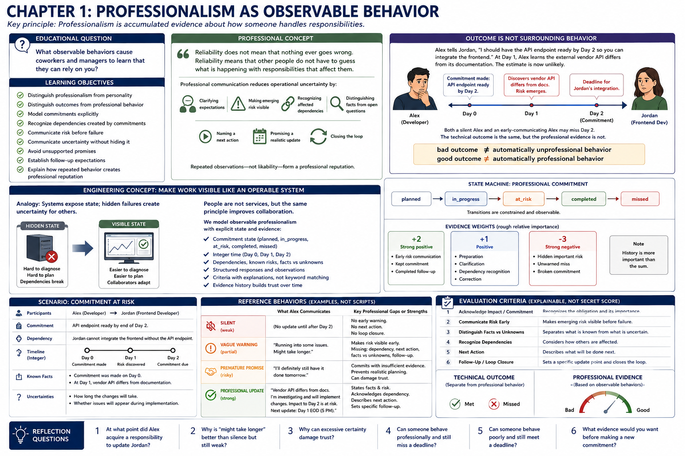

# Chapter 1: Professionalism as Observable Behavior



> **Key principle:** Professionalism is accumulated evidence about how someone handles responsibilities.

## Educational question

> What observable behaviors cause coworkers and managers to learn that they can rely on you?

Professionalism here does not mean charisma, extroversion, friendliness, clothing, conversational style, popularity, confidence, or whether someone “seems professional.” Those impressions can contain bias and give a learner little to practice. This laboratory instead observes preparation, commitments, timely risk communication, follow-through, correction, dependencies, uncertainty, and closed communication loops.

## Learning objectives

The learner should be able to:

- distinguish professionalism from personality;
- distinguish outcomes from professional behavior;
- model commitments explicitly;
- recognize dependencies created by commitments;
- communicate risk before failure;
- communicate uncertainty without hiding it;
- avoid unsupported promises;
- establish follow-up expectations; and
- explain how repeated behavior creates professional reputation.

## Professional concept

> Reliability does not mean that nothing ever goes wrong. Reliability means that other people do not have to guess what is happening with responsibilities that affect them.

A highly competent person can still be difficult to depend on when coworkers repeatedly have to ask: Is this still happening? Are we going to make the deadline? Did you see my message? Did you finish the thing you promised? Is there a problem? Should I be making another plan?

Professional communication reduces that operational uncertainty. Keeping a commitment is useful evidence, but reliability also appears when a person clarifies expectations, makes emerging risk visible, recognizes affected dependencies, distinguishes known facts from open questions, names a next action, promises a realistic update, and then closes the loop. Repeated observations—not likability—form a professional reputation.

### Outcome is not surrounding behavior

Alex tells Jordan, “I should have the API endpoint ready by Day 2 so you can integrate the frontend.” At Day 1, Alex learns that the external vendor API differs from its documentation. The estimate is now unlikely.

Both a silent Alex and an early-communicating Alex may miss Day 2. The technical outcome is the same, but the professional evidence is not. Early communication lets Jordan adapt dependent work; silence makes Jordan discover the failure. Conversely, hidden risk does not become responsible behavior merely because Alex gets lucky and finishes on Day 2. Thus:

```text
bad outcome != automatically unprofessional behavior
good outcome != automatically professional behavior
```

## Engineering concept

An operable system exposes relevant state. A system that silently fails makes diagnosis and dependency management difficult. A workflow with hidden risk creates a similar problem for collaborators. The analogy is limited—people are not services, and workplace judgment cannot be reduced to monitoring—but it explains the model's explicit commitment state, simulated time, dependencies, known risks, structured observations, criteria, and evidence history.

`ProfessionalCommitment` moves through constrained `planned`, `in_progress`, `at_risk`, `completed`, and `missed` states. Integer time (`Day 0`, `Day 1`, `Day 2`) makes runs deterministic rather than pretending to schedule real work. A `ProfessionalResponse` records observed semantic behavior, not keywords. Criteria produce explainable results, and relevant observations become trust events whose history remains available.

The small integer evidence weights express only rough relative importance: preparation, clarification, dependency recognition, and correction are `+1`; early risk communication, kept commitments, and completed follow-ups are `+2`; hidden important risk and unwarned misses are `-3`. The history is more important than the sum.

## Run the laboratory

```console
$ python -m soft_skills_lab scenario commitment-at-risk
$ python -m soft_skills_lab evaluate commitment-at-risk silent
$ python -m soft_skills_lab evaluate commitment-at-risk vague-warning
$ python -m soft_skills_lab evaluate commitment-at-risk premature-promise
$ python -m soft_skills_lab evaluate commitment-at-risk professional-update
$ python -m soft_skills_lab compare commitment-at-risk
```

The scenario command displays participants, commitment, dependency, integer timeline, known facts, uncertainties, and reference behaviors. Evaluation prints every criterion, explanation, evidence history, and the separate technical outcome. Comparison shows criteria side by side rather than producing a numeric leaderboard.

## What to observe

1. **Silent:** Alex hides the risk; Jordan asks after the deadline. There is neither early warning nor loop closure.
2. **Vague warning:** “Running into some issues. Might take longer.” makes risk visible before Day 2, so it is better than silence. It remains incomplete: Jordan's dependency, concrete next action, separated facts and unknowns, and follow-up point are absent.
3. **Premature promise:** “I'll definitely still have it done tomorrow” communicates, but converts insufficient evidence into certainty. Excessive certainty prevents Jordan from planning realistically and can damage trust.
4. **Professional update:** Alex states the vendor discrepancy and risk, acknowledges the frontend dependency, describes investigation, marks the completion time unknown, and establishes a specific next update.

Evaluation uses structured behaviors rather than exact strings. Equivalent wording with equivalent observations receives equivalent results. The `professional-missed` variation records a missed outcome after responsible investigation, early warning, and final status; the `hidden-risk-success` variation records a successful outcome alongside weak communication. A smaller test fixture models preparation for a T2 review: reviewing the T0 material, bringing the requested artifact, and preparing a question each leave observable evidence.

## Engineering tradeoffs

Deterministic evaluation makes individual behaviors inspectable and tests repeatable, but real communication depends on organizational culture, urgency, relationship history, channel, authority, and incomplete information. A specific update point that is useful in one workplace may be excessive or too slow in another. Structured fields require a human or scenario author to interpret semantic equivalence; this is not a natural-language classifier. Integer evidence weights cannot encode motive, severity, emergencies, accommodations, or every consequence. The laboratory intentionally holds those variables still so behaviors can be examined; later chapters can add context without Chapter 1 pretending to judge a whole person.

## Reflection

1. At what point did Alex acquire a responsibility to update Jordan?
2. Why is “might take longer” better than silence but still weak?
3. Why can excessive certainty damage trust?
4. Can someone behave professionally and still miss a deadline?
5. Can someone behave poorly and still meet a deadline?
6. What evidence would you want before making a new commitment?
