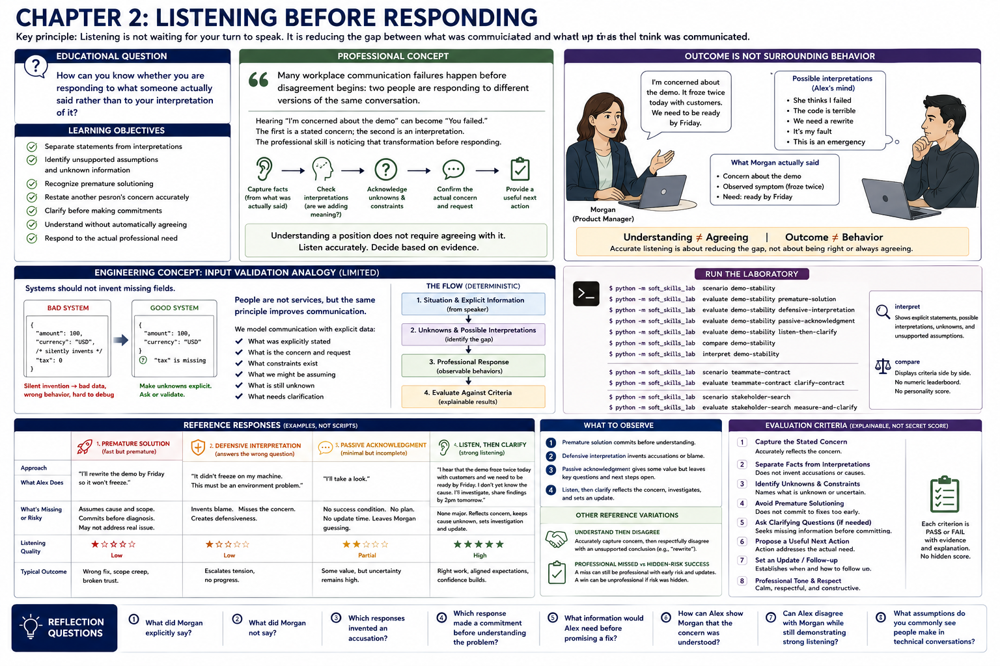

# Chapter 2: Listening Before Responding



> **Key principle:** Listening is not waiting for your turn to speak. It is reducing the gap between what was communicated and what you think was communicated.

## Educational question

> How can you know whether you are responding to what someone actually said rather than to your interpretation of it?

## Learning objectives

The learner should be able to:

- separate statements from interpretations;
- identify unsupported assumptions and unknown information;
- recognize premature solutioning;
- restate another person's concern accurately;
- clarify before making commitments;
- understand without automatically agreeing; and
- respond to the actual professional need.

## Professional concept

> Many workplace communication failures happen before disagreement begins: two people are responding to different versions of the same conversation.

Someone can hear “I'm concerned about the demo” and mentally transform it into “You failed.” The first is a stated concern; the second is an interpretation that invents an accusation. The professional skill is noticing that transformation before responding. Listening is observable here: facts are captured, unknowns and constraints are acknowledged, interpretations are checked, and the actual concern receives a useful next action. The model does not evaluate empathy, agreeableness, friendliness, charisma, introversion, extroversion, or a “good listener” identity.

Understanding a position does not require agreeing with it. Alex can accurately restate Morgan's concern and respectfully say there is not yet evidence for a rewrite. Automatic agreement earns no special credit, and evidence-based disagreement earns no penalty. Authority does not change this rule: managers can misunderstand technical details, assume incorrectly, or speak ambiguously. Professional listening understands a manager's concern accurately; it does not turn every manager interpretation into unquestionable fact.

## Engineering concept

Input validation offers a limited analogy. A system interpreting a contract should not silently invent missing fields. A professional likewise should not silently invent intent, requirements, blame, cause, or certainty. `CommunicationContext` records scenario-authored explicit facts, concern, request, constraints, possible interpretations, unknowns, and unsupported assumptions. `ListenerInterpretation` records what a reference listener understood, inferred, assumed, needs clarified, and proposes. The scenario author supplies these semantics; the laboratory does not infer intent from free-form language.

The flow remains the existing one: situation and explicit information lead to unknowns and possible interpretations; a structured `ProfessionalResponse` records observable behavior; reusable criteria produce an explainable evaluation. This is deterministic contract metadata, not a natural-language engine.

## Run the laboratory

```console
$ python -m soft_skills_lab scenario demo-stability
$ python -m soft_skills_lab evaluate demo-stability premature-solution
$ python -m soft_skills_lab evaluate demo-stability defensive-interpretation
$ python -m soft_skills_lab evaluate demo-stability passive-acknowledgment
$ python -m soft_skills_lab evaluate demo-stability listen-then-clarify
$ python -m soft_skills_lab compare demo-stability
$ python -m soft_skills_lab interpret demo-stability
$ python -m soft_skills_lab scenario teammate-contract
$ python -m soft_skills_lab evaluate teammate-contract clarify-contract
$ python -m soft_skills_lab scenario stakeholder-search
$ python -m soft_skills_lab evaluate stakeholder-search measure-and-clarify
```

`interpret` displays explicit statements, possible interpretations, unknowns, and unsupported assumptions directly from immutable scenario data. `compare` displays criteria side by side without collapsing listening into a numeric or personality score.

## What to observe

1. **Premature solution:** a fast rewrite promise selects a cause, scope, and commitment before diagnosis. Fast response is not necessarily good listening.
2. **Defensive interpretation:** Alex answers an accusation Morgan did not make and introduces unsupported blame.
3. **Passive acknowledgment:** “I'll take a look” avoids blame and has some value, so concern capture is partial rather than identical to defensiveness. It still leaves the success condition, unknowns, and follow-up unresolved.
4. **Listen, then clarify:** Alex reflects the demo risk and observed symptom, keeps the cause unknown, establishes what needs deciding, investigates, and provides an update point. Useful clarification directs work; it is not helplessness. Investigation is not a promise that a particular fix will work.

The `understand-then-disagree` reference variation demonstrates accurate concern capture before rejecting an unsupported rewrite conclusion. In the peer example, Jordan's contract mismatch does not imply a request for Alex to implement the frontend; the next step is deciding which contract is authoritative. In the stakeholder example, “slow” does not mean “rewrite”: workflow, latency, frequency, environment, impact, and acceptable performance remain unknown.

## Engineering tradeoffs

Structured metadata makes semantic equivalence testable without keyword heuristics, but a scenario author must encode that equivalence. The laboratory cannot judge arbitrary conversation text, infer human intent, or decide the one correct response across cultures, authority relationships, accessibility needs, urgency, or organizational history. Chapter 3 may build on identified unknowns to study useful questions; later stakeholder, disagreement, and conflict chapters may add context. This chapter intentionally implements none of those future curricula, uses no AI API, and makes no personality assessment.

## Reflection

1. What did Morgan explicitly say?
2. What did Morgan not say?
3. Which responses invented an accusation?
4. Which response made a commitment before understanding the problem?
5. What information would Alex need before promising a fix?
6. How can Alex show Morgan that the concern was understood?
7. Can Alex disagree with Morgan while still demonstrating strong listening?
8. What assumptions do you commonly see people make in technical conversations?
