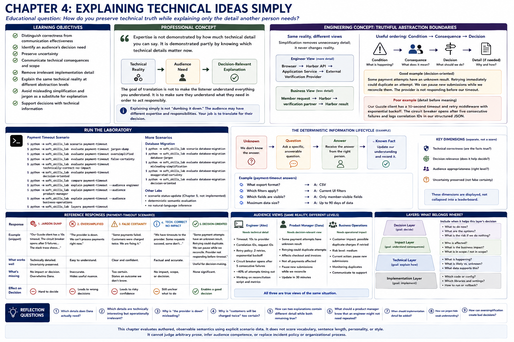

# Chapter 4: Explaining Technical Ideas Simply



## Educational question

> How do you preserve technical truth while explaining only the detail another person needs?

## Learning objectives

The learner should be able to:

- distinguish correctness from communication effectiveness;
- identify an audience's decision need;
- preserve uncertainty;
- communicate technical consequences and scope;
- remove irrelevant implementation detail;
- explain the same technical reality at different abstraction levels;
- avoid misleading simplification and jargon as a substitute for explanation; and
- support decisions with technical information.

## Professional concept

Chapter 2 established “understand the concern before responding.” Chapter 3 reduced decision-relevant uncertainty with focused questions. Chapter 4 takes the next step: explain the resulting technical understanding at the level required by the listener's decision.

> Expertise is not demonstrated by how much technical detail you can say. It is demonstrated partly by knowing which technical details matter now.

Explaining simply does not mean deleting all technical detail, and demonstrating expertise does not mean including everything. A good explanation preserves information necessary for the audience's decision while removing detail that does not help that decision:

```text
technical reality -> audience need -> decision-relevant explanation
```

Technical correctness, decision relevance, and audience appropriateness are separate dimensions. A correct timeout walkthrough can leave Dana unable to decide. A short claim that “the provider is down” can be comprehensible and false. More detail is not automatically better.

> The goal of translation is not to make the listener understand everything you understand. It is to make sure they understand what they need in order to act responsibly.

Explaining simply is not “dumbing it down.” Dana may understand operations, finance, regulation, customer behavior, and organizational risk better than Alex. Job title is not a technical-competence measurement. Alex's responsibility is to translate the technical condition into the domain relevant to Dana.

## Engineering concept: truthful abstraction boundaries

A caller of an API needs the contract relevant to its interaction, not every implementation detail behind it. Professional audiences likewise need different truthful views of one reality. The model's architecture example preserves these boundaries:

```text
Engineer: Browser -> Harbor API -> Application Service -> External Verification Provider
Business: Member request -> Harbor -> verification partner -> Harbor result
```

The second view groups internal boundaries; it does not invent a different route. Simplification should remove unnecessary detail, not alter reality. Audience adaptation is selection and translation of established facts, never permission to change them.

A useful, non-rigid ordering is:

```text
Condition -> Consequence -> Decision -> Supporting detail if needed
```

For example: “Some payment attempts have an unknown result. Retrying immediately could duplicate an attempt. We can pause new submissions while we reconcile them. The provider is not responding before our timeout.” This makes the consequence available before details. Starting with “Our Guzzle client has a 10-second timeout and retry middleware...” makes Dana find the operational meaning herself. Sometimes an engineer needs that supporting detail first; context controls the abstraction.

## Run the laboratory

```bash
python -m soft_skills_lab scenario payment-timeout
python -m soft_skills_lab evaluate payment-timeout jargon-dump
python -m soft_skills_lab evaluate payment-timeout oversimplified
python -m soft_skills_lab evaluate payment-timeout false-certainty
python -m soft_skills_lab evaluate payment-timeout technically-correct-no-impact
python -m soft_skills_lab evaluate payment-timeout decision-oriented
python -m soft_skills_lab compare payment-timeout
python -m soft_skills_lab explain payment-timeout --audience engineer
python -m soft_skills_lab explain payment-timeout --audience product-manager
python -m soft_skills_lab explain payment-timeout --audience business-operations
python -m soft_skills_lab layers payment-timeout

python -m soft_skills_lab scenario database-migration
python -m soft_skills_lab evaluate database-migration database-jargon
python -m soft_skills_lab evaluate database-migration misleading-simplification
python -m soft_skills_lab evaluate database-migration exaggerated-certainty
python -m soft_skills_lab evaluate database-migration decision-oriented
```

The commands use authored semantic fields, not arbitrary natural-language understanding. The comparison displays dimensions rather than combining them into a leaderboard. `layers` makes visible why not every true fact belongs in every explanation.

## What to observe

1. **Jargon dump:** it preserves technical truth and uncertainty, yet implementation detail obscures Dana's decision. Technical correctness does not equal effectiveness.
2. **Oversimplified:** it is easy to understand but claims the provider is down despite successful responses. Simplicity does not equal accuracy.
3. **False certainty:** duplicate attempts are a risk, not an established outcome. “Could” preserves the known-versus-unknown boundary.
4. **Technically correct without impact:** timeout state is described accurately, but customer consequence and operational choice remain missing.
5. **Decision-oriented:** condition, uncertainty, impact, affected and unaffected scope, mitigation, and next work are visible without an implementation walkthrough.
6. **Audience views:** the engineer receives timeout, correlation, retry, and reconciliation detail; product receives workflow, customer, scope, uncertainty, and mitigation; operations receives risk and the available control. All derive from the same facts.

The migration scenario applies the distinction elsewhere. The change can prevent writes and interrupt a workflow; its duration is estimated, not guaranteed. A lower-traffic window reduces risk. “The database will be offline” is simple but misleading, while lock vocabulary alone does not support the product decision.

## Reflection

1. Which details does Dana actually need?
2. Which details are technically interesting but operationally irrelevant?
3. Why is “the provider is down” misleading?
4. Why is “customers will be charged twice” too certain?
5. How can two explanations contain different detail while both remaining true?
6. What should a product manager know that an engineer might not need repeated?
7. When should implementation detail be added?
8. How can jargon hide weak understanding?
9. How can oversimplification create bad decisions?

This chapter does not score vocabulary, sentence length, personality, or style. Its deterministic reference paths cannot judge arbitrary prose, infer audience competence, or replace incident policy. Chapter 5 status-update behavior is intentionally not implemented.
