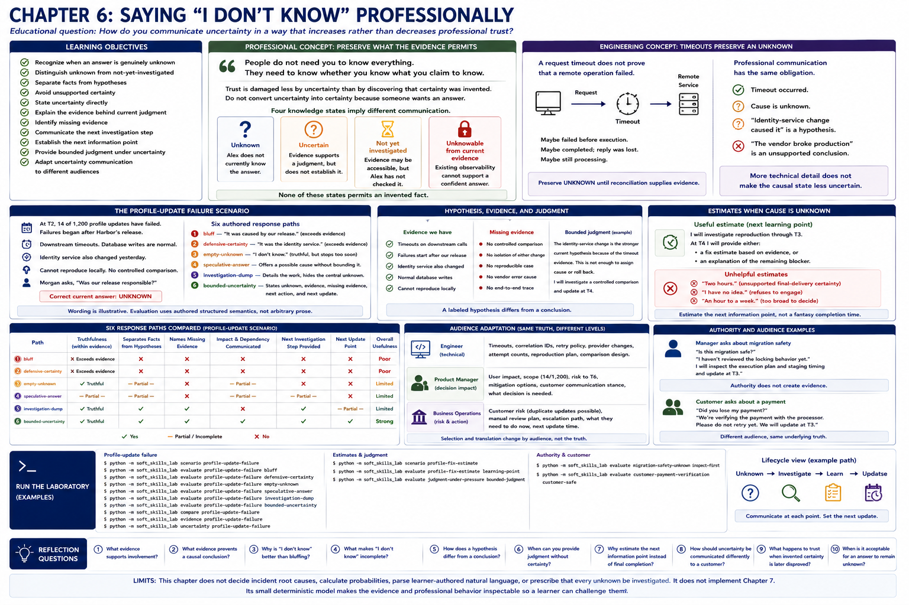

# Chapter 6: Saying “I Don't Know” Professionally



## Educational question

> How do you communicate uncertainty in a way that increases rather than decreases professional trust?

Professional uncertainty is explicit, bounded, and connected to a next action. This chapter rejects both invented certainty and an empty “I don't know” when useful investigation is available.

## Learning objectives

The learner should be able to:

- recognize when an answer is genuinely unknown;
- distinguish unknown from not-yet-investigated;
- separate facts from hypotheses;
- avoid unsupported certainty;
- state uncertainty directly;
- explain the evidence behind current judgment;
- identify missing evidence;
- communicate the next investigation step;
- establish the next information point;
- provide bounded judgment under uncertainty; and
- adapt uncertainty communication to different audiences.

## Professional concept: preserve what the evidence permits

> People do not need you to know everything. They need to know whether you know what you claim to know.

Trust is damaged less by uncertainty than by discovering that certainty was invented. “I don't know” can therefore be a strong professional answer when it accurately describes the evidence. Do not convert uncertainty into certainty merely because another person wants an answer. Authority does not turn missing evidence into knowledge: a junior developer does not need to bluff when a senior manager asks.

The other extreme is stopping thought and transferring the whole uncertainty to the listener. “I don't know yet” becomes professionally useful when it is followed by a credible method for learning more. That does not mean every unknown must be solved immediately. An investigation may cost more than the decision warrants, and some states remain permanently unknowable. Name the impact and choose deliberately.

### Four knowledge states

- **Unknown:** Alex does not currently know the answer.
- **Uncertain:** evidence supports a judgment, but does not establish it.
- **Not yet investigated:** the evidence may be accessible, but Alex has not checked it.
- **Unknowable from current evidence:** existing observability cannot support a confident answer; new evidence or a controlled comparison is required.

These states imply different communication. An uninspected migration calls for inspection. An unobservable processor outcome calls for verification and a safe customer action. A partially supported cause permits a labeled hypothesis. None permits an invented fact.

## Engineering concept: timeouts preserve an unknown

A request timeout does not prove that a remote operation failed. The operation might have failed before execution, completed while its reply was lost, or still be processing. A distributed system that silently converts timeout into success or failure corrupts its state. It should preserve **unknown** until reconciliation supplies evidence.

Professional communication has the same obligation. A downstream timeout is a fact. “The identity-service change caused it” is a hypothesis. “The vendor broke production” is an unsupported conclusion. More technical detail does not make the causal state less uncertain.

## The profile-update failure

At T2, 14 of 1,200 profile updates have failed. Failures began after Harbor's release, contain downstream timeout evidence, and have normal database writes. The identity service also changed yesterday. Alex cannot reproduce the failure locally, and no controlled comparison has isolated either change. Morgan asks, “Was our release responsible?” The correct current answer is **unknown**.

Compare six paths:

1. **bluff** says Harbor caused it and exceeds the evidence;
2. **defensive-certainty** declares Harbor innocent and blames the service, also exceeding the evidence;
3. **empty-unknown** is truthful and better than either bluff, but supplies no useful next step;
4. **speculative-answer** presents a possible cause without labeling or bounding it;
5. **investigation-dump** supplies details while hiding the direct answer; and
6. **bounded-uncertainty** answers “we don't know yet,” gives the evidence and missing evidence, compares traces, and establishes T4 as the next update.

The strongest response may cover what is known, unknown, currently suspected, why, the next action, and the update point. This is a useful pattern, not a rigid universal script.

## Hypothesis, evidence, and judgment

Uncertainty does not prohibit judgment. It requires labeling judgment accurately. Under pressure—“I understand you don't know for sure, but what do you think?”—Alex can say that the external-service path is the stronger current hypothesis because of the timeout evidence, while stating that this alone is insufficient for a rollback decision.

No arbitrary confidence percentage is needed. The evidence basis is inspectable. Requested certainty remains different from available certainty.

## Estimates when the cause is unknown

“Two hours” is not a useful estimate when root cause and reproduction are absent; it is unsupported final-delivery certainty. “I have no idea” refuses to engage, while “an hour to a week” is too broad to support a decision.

Sometimes the responsible estimate is an estimate for the next information point rather than final completion: Alex expects to investigate reproduction through T3, then will provide a fix estimate or explain the remaining obstacle. An estimate for learning is not an estimate for delivery.

## Authority and audience

When senior Morgan asks junior Alex whether an uninspected migration is safe, Alex should say that locking behavior has not been reviewed and inspect the execution plan and staging timing. Being senior does not supply evidence; being junior does not create a duty to bluff.

A customer asking “Did you lose my payment?” needs the same underlying truth in a different abstraction. “We are verifying the payment with the processor; please do not retry yet; we will update at T3” preserves the unknown while supplying a safe decision, investigation, and update. Audience adaptation changes selection and language, not truth.

## Run the laboratory

```bash
python -m soft_skills_lab scenario profile-update-failure
python -m soft_skills_lab evaluate profile-update-failure bluff
python -m soft_skills_lab evaluate profile-update-failure defensive-certainty
python -m soft_skills_lab evaluate profile-update-failure empty-unknown
python -m soft_skills_lab evaluate profile-update-failure speculative-answer
python -m soft_skills_lab evaluate profile-update-failure investigation-dump
python -m soft_skills_lab evaluate profile-update-failure bounded-uncertainty
python -m soft_skills_lab compare profile-update-failure
python -m soft_skills_lab evidence profile-update-failure
python -m soft_skills_lab uncertainty profile-update-failure
python -m soft_skills_lab scenario profile-fix-estimate
python -m soft_skills_lab evaluate profile-fix-estimate learning-point
python -m soft_skills_lab evaluate judgment-under-pressure bounded-judgment
python -m soft_skills_lab evaluate migration-safety-unknown inspect-first
python -m soft_skills_lab evaluate customer-payment-verification customer-safe
```

## What to observe

Observe how bluffing and defensive certainty both exceed evidence; empty uncertainty preserves truth but stops too soon; a labeled hypothesis differs from fault language; and an information dump can conceal the central unknown. Then inspect bounded uncertainty, an estimate for a learning point, judgment under pressure, authority differences, and customer-safe adaptation.

Evaluation is deterministic and behavior-based. Scenario metadata explicitly records facts, hypotheses, missing evidence, actions, impact, and update points. The laboratory neither parses arbitrary prose nor performs probabilistic inference.

## Reflection

1. What evidence supports the statement that Harbor's release might be involved?
2. What evidence prevents Alex from concluding that it caused the problem?
3. Why is “I don't know” better than bluffing?
4. What makes “I don't know” incomplete in this scenario?
5. What is the difference between a hypothesis and a conclusion?
6. When can you provide judgment without certainty?
7. Why can estimating the next learning point be more useful than inventing a completion estimate?
8. How should uncertainty be communicated differently to a customer?
9. What happens to trust when invented certainty is later disproved?
10. When is it professionally acceptable for an answer to remain unknown?

## Limits

This chapter does not decide incident root causes, calculate probabilities, parse learner-authored natural language, or prescribe that every unknown be investigated. It does not implement Chapter 7. Its small deterministic model makes the evidence and professional behavior inspectable so a learner can challenge them.

