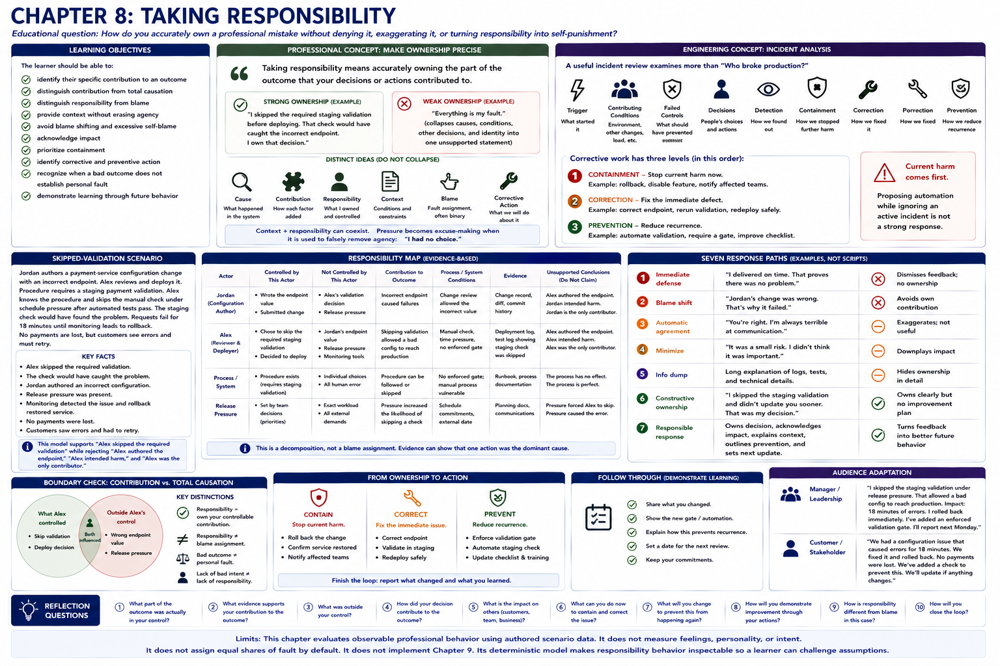

# Chapter 8: Taking Responsibility



## Educational question

> How do you accurately own a professional mistake without denying it, exaggerating it, or turning responsibility into self-punishment?

Responsibility is observable professional behavior. This laboratory examines what a person does with evidence: identifies a contribution, preserves its boundary, acknowledges impact, contains harm, corrects the defect, reduces recurrence, and follows through. It does not score guilt, shame, confidence, remorse intensity, personality, self-esteem, or whether somebody appears upset enough.

## Learning objectives

The learner should be able to:

- identify their specific contribution to an outcome;
- distinguish contribution from total causation;
- distinguish responsibility from blame;
- provide context without erasing agency;
- avoid blame shifting and excessive self-blame;
- acknowledge impact;
- prioritize containment;
- identify corrective and preventive action;
- recognize when a bad outcome does not establish personal fault; and
- demonstrate learning through future behavior.

## Professional concept: make ownership precise

> Taking responsibility means accurately owning the part of the outcome that your decisions or actions contributed to.

Responsibility should become more precise as the evidence becomes clearer. “Everything is my fault” is weak because it collapses causes, conditions, other decisions, and identity into one unsupported statement. A stronger statement is:

> I skipped the required staging validation before deploying. That check would have caught the incorrect endpoint. I own that decision.

Ownership is not accepting all blame. **Responsibility asks, “What part was mine to handle?” Blame often asks, “Whose fault is this?”** Responsibility decomposition is preferable to a winner/loser assignment, although evidence may sometimes show that one action was the dominant cause. The model must represent what evidence says, not manufacture equal shares.

Cause, contribution, responsibility, context, blame, and corrective action are distinct. Jordan authored an incorrect configuration. Alex decided to deploy without a required check. A manual control and release pressure were process conditions. Those facts can coexist. Alex is responsible for skipping validation without being declared the sole cause or the configuration author.

An explanation can provide useful context without removing responsibility:

> We were under release pressure, and I chose to skip the staging validation. That was my decision, and the check would have caught this configuration problem.

Thus **context + responsibility can coexist**. Pressure becomes excuse-making when it is used to falsely remove agency: “I had no choice.” A weak process can contribute without erasing a decision inside it; individual responsibility likewise does not erase the weak process.

Lack of bad intent does not eliminate responsibility for an avoidable professional action. Alex did not intend an outage, and responsibility does not imply malicious intent. What matters here is the supported decision to bypass the check. Conversely, a bad outcome is not proof of personal fault. Responsibility is for decisions and actions, not omniscience.

The purpose of responsibility is not punishment. It is to restore clarity, reduce harm, and improve future behavior. Accountability is strongest when it produces better future decisions, not the harshest self-description.

## Engineering concept: incident analysis

A useful incident review does not stop at “Who broke production?” It examines the triggering event, contributing conditions, failed controls, decisions, detection, containment, correction, and prevention. Professional responsibility should likewise be specific and evidence-based. This analogy is not a complete reliability-engineering method and the responsibility map is not legal-liability analysis.

Corrective work has three levels:

1. **Containment** stops current harm: rollback, disable a feature, or notify affected teams.
2. **Correction** fixes the immediate defect: correct the endpoint, rerun validation, and redeploy safely.
3. **Prevention** reduces recurrence: automate validation, require a gate, or improve a checklist.

Current harm comes first. Proposing automation while ignoring an active incident is not a strong response.

## Skipped-validation scenario

Jordan authors a payment-service configuration change with an incorrect endpoint. Alex reviews and deploys it. Procedure requires a staging payment validation, Alex knows the procedure, and Alex skips the manual check under schedule pressure after automated tests pass. The staging check would have found the problem. Requests fail for 18 minutes until monitoring leads to rollback. No payments are lost, but customers see errors and must retry.

The deterministic `ResponsibilityMap` records each actor's controlled and uncontrolled factors, contributions, process conditions, results, evidence, unsupported conclusions, and action boundaries. It supports “Alex skipped the required validation” while rejecting “Alex authored the endpoint,” “Alex intended harm,” and “Alex was the only contributor.”

### Seven response paths

1. **Deny** points only to Jordan and ignores Alex's deployment decision.
2. **Blame process** identifies a valid automation opportunity but uses it alone, erasing the knowingly skipped control.
3. **Excuse pressure** supplies real context but falsely denies agency.
4. **Over-own** claims the entire incident and condemns the self; excessive self-blame is not stronger accountability.
5. **Empty apology** acknowledges a problem but identifies neither contribution nor corrective work.
6. **Explanation without ownership** accurately lists tests, pressure, authorship, and manual process while never owning the skipped check.
7. **Accurate ownership** names the decision and its effect, preserves context, notes rollback, corrects and validates before redeployment, and proposes a harder-to-bypass gate.

No magic apology phrase is required. Responses have scenario-authored semantic properties; the evaluator does not parse arbitrary text. Behaviorally equivalent ownership receives equivalent results.

## Related scenarios and later evidence

In **missed handoff**, Alex completes an API schema at T3 but forgets the promised T4 handoff. Jordan waits until T5 and loses a day. Alex owns sending it, sends it immediately, recognizes the impact, and tracks acknowledgment next time. This reuses Chapter 1's commitment and loop-closure concepts. “Jordan could have asked,” workload context, and a vague apology do not close Alex's commitment.

In **shared responsibility**, Priya leaves timezone behavior ambiguous, Alex notices and assumes UTC rather than clarifying, and Morgan approves without reviewing the unresolved requirement. Alex should own the assumption, not the entire failure.

In **unavoidable outcome**, Alex performs every required validation, available evidence supports deployment, and undocumented vendor behavior causes a failure no reasonable pre-deployment test could detect. A professional response owns investigation and recovery while declining unsupported personal fault. **Bad outcome != personal fault.**

In the follow-up, a staging gate is installed. Alex performs it on the next release, detects another invalid endpoint, stops the deployment, and reports it. Trust history records acknowledged responsibility, correction, completed prevention, follow-up, and changed behavior. Verbal ownership is not demonstrated learning.

> Accountability becomes credible when corrective behavior is visible later.

## Run the laboratory

```bash
python -m soft_skills_lab scenario skipped-validation
python -m soft_skills_lab evaluate skipped-validation deny
python -m soft_skills_lab evaluate skipped-validation blame-process
python -m soft_skills_lab evaluate skipped-validation excuse-pressure
python -m soft_skills_lab evaluate skipped-validation over-own
python -m soft_skills_lab evaluate skipped-validation empty-apology
python -m soft_skills_lab evaluate skipped-validation explanation-without-ownership
python -m soft_skills_lab evaluate skipped-validation accurate-ownership
python -m soft_skills_lab compare skipped-validation
python -m soft_skills_lab responsibility skipped-validation
python -m soft_skills_lab scenario missed-handoff
python -m soft_skills_lab evaluate missed-handoff own-and-recover
python -m soft_skills_lab responsibility missed-handoff
python -m soft_skills_lab scenario shared-responsibility
python -m soft_skills_lab evaluate shared-responsibility bounded-ownership
python -m soft_skills_lab responsibility shared-responsibility
python -m soft_skills_lab scenario unavoidable-outcome
python -m soft_skills_lab evaluate unavoidable-outcome evidence-bounded
python -m soft_skills_lab responsibility unavoidable-outcome
python -m soft_skills_lab scenario responsibility-follow-up
python -m soft_skills_lab evaluate responsibility-follow-up demonstrated-learning
python -m soft_skills_lab learning responsibility-follow-up
```

## What to observe

- Denial and blame shifting omit Alex's supported contribution.
- Accurate context can coexist with agency; an excuse falsely removes it.
- Excessive self-blame obscures boundaries and is not rewarded.
- An apology alone is not corrective action.
- Explanation without ownership can be factually accurate yet professionally incomplete.
- Containment precedes correction; prevention follows both.
- Shared responsibility need not be equal and does not imply sole causation.
- Refusing unsupported fault after an unavoidable outcome is professional evidence discipline.
- Later changed behavior is stronger trust evidence than one well-worded statement.

## Reflection

1. What specific action does Alex own?
2. What did Jordan own?
3. Which process condition contributed to the incident?
4. Why doesn't schedule pressure remove Alex's responsibility?
5. Why is “this entire incident is my fault” inaccurate?
6. Why isn't “I'm sorry” sufficient by itself?
7. What should happen before discussing long-term automation?
8. How can process improvement and individual ownership coexist?
9. When would refusing to accept blame actually be the professional response?
10. What later evidence would convince you that Alex learned from the incident?

## Model limits

Meanings and evidence are explicitly authored and deterministic. The laboratory does not parse arbitrary apologies, call AI APIs, infer guilt or remorse, model personality or intent, score emotional display, or assign legal liability. It evaluates separate observable criteria, not an accountability percentage. Organizational policy, power, culture, law, safety, and missing facts can change an appropriate real-world response. Chapter 9 disagreement mechanisms are intentionally not implemented here.
