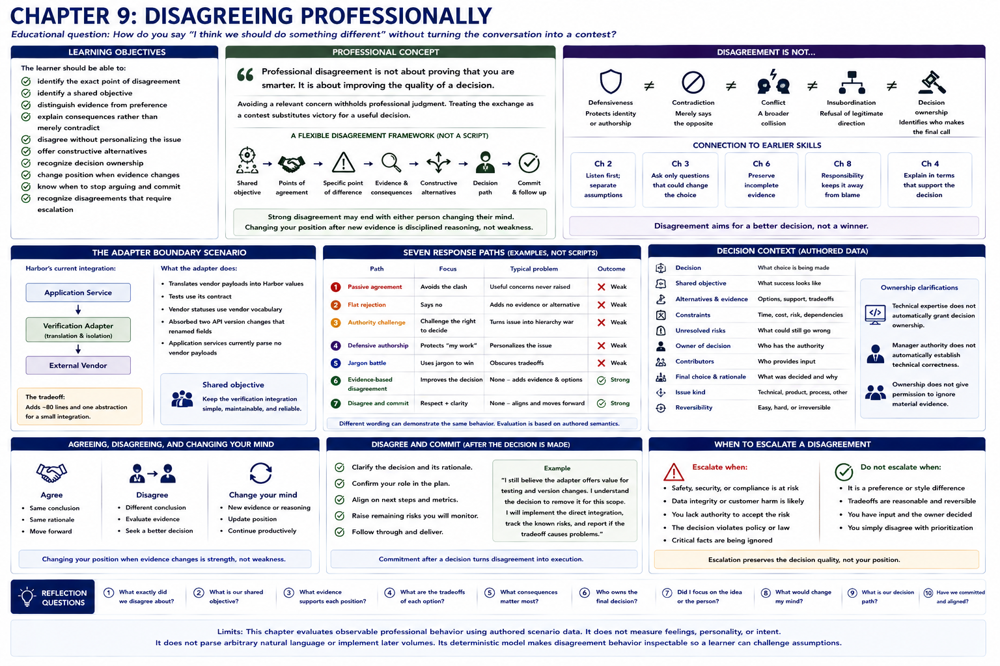

# Chapter 9: Disagreeing Professionally



## Educational question

> How do you say “I think we should do something different” without turning the conversation into a contest?

Professional disagreement focuses on the decision, evidence, constraints, and consequences rather than on defeating the other person. Respect does not require agreement. Agreement does not automatically prove collaboration.

## Learning objectives

The learner should be able to:

- identify the exact point of disagreement;
- identify a shared objective;
- distinguish evidence from preference;
- explain consequences rather than merely contradict;
- disagree without personalizing the issue;
- offer constructive alternatives;
- recognize decision ownership;
- change position when evidence changes;
- know when to stop arguing and commit; and
- recognize disagreements that require escalation.

## Professional concept

> Professional disagreement is not about proving that you are smarter. It is about improving the quality of a decision.

Avoiding a relevant concern because disagreement feels impolite withholds professional judgment. Treating the exchange as a contest substitutes victory for a useful decision. A disagreement is a specific difference about an idea, conclusion, or choice. It is not automatically defensiveness, contradiction, conflict, insubordination, or decision ownership. Defensiveness protects identity or authorship; contradiction merely says the opposite; conflict is a broader collision; insubordination concerns refusal of legitimate direction; decision ownership identifies who makes the final call.

A response can flexibly connect a **shared objective**, a point of agreement, the specific difference, decision-relevant evidence and consequence, an alternative, and a decision path. This is a reasoning aid, not a mandatory script. If the other person cannot explain what you disagree about after the conversation, the disagreement was probably not communicated clearly.

The strongest disagreement may end with either person changing their mind. Receiving feedback (Chapter 7) did not require automatic agreement; likewise, raising an objection does not require defending it after contrary evidence arrives. Changing a position after new evidence is disciplined reasoning, not weakness.

## Connection to earlier skills

Understanding Morgan's concern before replying and separating statements from assumptions reuse Chapter 2. Asking only questions that could change the choice reuses Chapter 3. Preserving incomplete evidence and labeling hypotheses reuse Chapter 6. Evidence-bounded responsibility from Chapter 8 keeps the conversation away from blame. Chapter 4 explains why legitimate jargon is not useful until it connects to the audience's practical decision.

## Engineering concept: a design review

A useful design review asks:

- What problem are we solving?
- What constraints matter?
- What evidence supports this design?
- What tradeoff does each option introduce?
- Is the decision reversible?
- Who owns the final choice?

It does not ask, “Which engineer can defend their preferred architecture longest?” The laboratory's immutable `DecisionContext` records the decision, shared objective, alternatives and evidence, constraints, unresolved risks, owner, contributors, final choice, rationale, issue kind, and reversibility. It stays deliberately small. Contributors surface evidence; the owner makes the call. Technical expertise does not itself grant decision ownership, manager authority does not establish technical correctness, and ownership does not permit material evidence to be ignored.

## Primary laboratory: the adapter boundary

Harbor currently uses:

```text
Application Service
      |
      v
Verification Adapter
      |
      v
External Vendor
```

The adapter translates vendor payloads into Harbor values, tests use its contract, vendor statuses use vendor vocabulary, and two API versions changed field names. Application services currently parse no vendor payloads. Conversely, the boundary adds about 80 lines and another abstraction, while the current integration is small. Morgan thinks it may be unnecessary.

Both participants share this objective:

> Keep the verification integration simple, maintainable, and reliable.

Inspect passive agreement, flat rejection, an authority challenge, defensive attachment to authored work, a jargon battle, evidence-based disagreement, and disagree-and-commit. “I wrote it” is authorship, not architectural evidence. “Hexagonal architecture” may name a legitimate concept, but without a practical consequence it does not advance this choice.

The evidence-based path recognizes that unnecessary abstraction should be removed, distinguishes this boundary, cites vendor changes and isolation, offers to reduce ceremony, and names a decision path. Exact language is not scored; authored behavioral metadata is. A differently worded path demonstrates that equivalence.

## Disagree and commit

After Alex's evidence is heard, Morgan may still choose direct integration and accept the tradeoff. When Morgan legitimately owns this reversible, acceptable choice, Alex can confirm it, document the known coupling, implement professionally, and stop repeating the same argument unless new evidence emerges:

> I disagree with the choice, but I understand the decision and will implement it.

This is valid only when the concern was heard, evidence was surfaced, a legitimate owner made an acceptable tradeoff, and no safety, legal, security, ethical, or authorization boundary was crossed. It never means suppressing critical risk, following clearly unsafe or unauthorized direction silently, or pretending agreement. Professional disagreement includes knowing when the decision has been made.

## Other decisions

### Deadline and tests

Priya wants the customer-data export Friday and proposes deferring automated tests. Friday has commercial value, but the new export has complex filters; manual checking is less comprehensive, and automated validation takes about one simulated day. Silent agreement withholds risk. Emotional rejection personalizes it. “We can never skip tests” ignores the actual tradeoff. The constructive path preserves the business goal by shipping validated CSV Friday and deferring Excel. A useful disagreement often includes an alternative that preserves the underlying business goal.

### Preference versus defect

Jordan's solution and Alex's solution are both valid. The model classifies disputed points explicitly as correctness issues, maintainability tradeoffs, conventions, personal preferences, or material risks. It does not reward Alex for presenting style as correctness:

```text
preference != defect
```

### When Morgan is correct

A benchmark establishes that Morgan's batching proposal uses fewer calls without adding latency. Alex explicitly names the new evidence, updates the position, and stops defending the earlier view. Professional disagreement includes changing your mind.

### Incomplete evidence

Two cache strategies remain plausible because production workload evidence is missing. A time-boxed benchmark, prototype, reversible decision, or explicit risk acceptance can resolve more than another round of argument. Not every disagreement can be solved by arguing more.

### Material-risk boundary

Logging sensitive customer data is not an ordinary architecture preference. If Morgan says “ship it anyway,” Alex should state the exposure clearly, refuse to normalize it, offer safe diagnostics, and use the security or compliance path. Some disagreements are ordinary tradeoffs. Others cross safety, legal, security, ethical, or authorization boundaries and require escalation. Detailed escalation judgment is intentionally deferred to later chapters.

## Run the laboratory

```bash
python -m soft_skills_lab scenario adapter-boundary
python -m soft_skills_lab evaluate adapter-boundary passive-agreement
python -m soft_skills_lab evaluate adapter-boundary flat-rejection
python -m soft_skills_lab evaluate adapter-boundary authority-challenge
python -m soft_skills_lab evaluate adapter-boundary defensive-ownership
python -m soft_skills_lab evaluate adapter-boundary jargon-battle
python -m soft_skills_lab evaluate adapter-boundary evidence-based-disagreement
python -m soft_skills_lab evaluate adapter-boundary evidence-based-variation
python -m soft_skills_lab evaluate adapter-boundary disagree-and-commit
python -m soft_skills_lab compare adapter-boundary
python -m soft_skills_lab decision adapter-boundary
python -m soft_skills_lab evaluate reporting-deadline scope-reduction
python -m soft_skills_lab decision reporting-deadline
python -m soft_skills_lab evaluate code-review-preference name-preference
python -m soft_skills_lab evaluate manager-correct update-position
python -m soft_skills_lab evaluate cache-strategy prototype
python -m soft_skills_lab evaluate sensitive-logging escalate
python -m soft_skills_lab evaluate sensitive-logging commit-anyway
python -m soft_skills_lab disagreement-trust
```

## What to observe

- Passive agreement reduces immediate friction but withholds relevant evidence.
- Blunt rejection states a difference without helping anyone evaluate it.
- Authority and identity arguments personalize a decision.
- Attachment to one's own code confuses design criticism with personal criticism.
- Jargon helps only when connected to consequences and audience needs.
- Evidence-based disagreement preserves both accuracy and respect.
- Disagree-and-commit follows legitimate resolution rather than pretending agreement.
- Preference must not be inflated into correctness.
- New evidence can properly reverse either participant's view.
- A reversible experiment can outperform prolonged argument under uncertainty.
- Material data risk requires escalation rather than routine commitment.
- Trust can increase when colleagues learn that you raise concerns clearly and still support responsibly resolved decisions.

The comparison keeps understanding, evidence, non-personalization, alternatives, and ownership separate. It never creates a collaboration, confidence, dominance, or personality score.

## Reflection

1. What concern is Morgan actually raising?
2. What shared objective do Morgan and Alex have?
3. Which evidence supports keeping the adapter?
4. Which evidence supports removing it?
5. Why is “I wrote it for a reason” weak evidence?
6. When does technical detail help the decision?
7. What is the difference between a preference and a defect?
8. Who owns the final architecture decision in this scenario?
9. When should Alex stop arguing?
10. Under what circumstances should Alex escalate rather than commit?
11. What evidence should cause Alex to change position?
12. How can disagreement increase professional trust?

## Boundaries

This deterministic laboratory evaluates authored semantics, not arbitrary debate text or inferred emotion. It does not score assertiveness, confidence, dominance, personality, or who “won.” It does not make legal or compliance determinations. Chapter 10 conflict and de-escalation, and the later full escalation and professional-judgment treatment, remain unimplemented.
