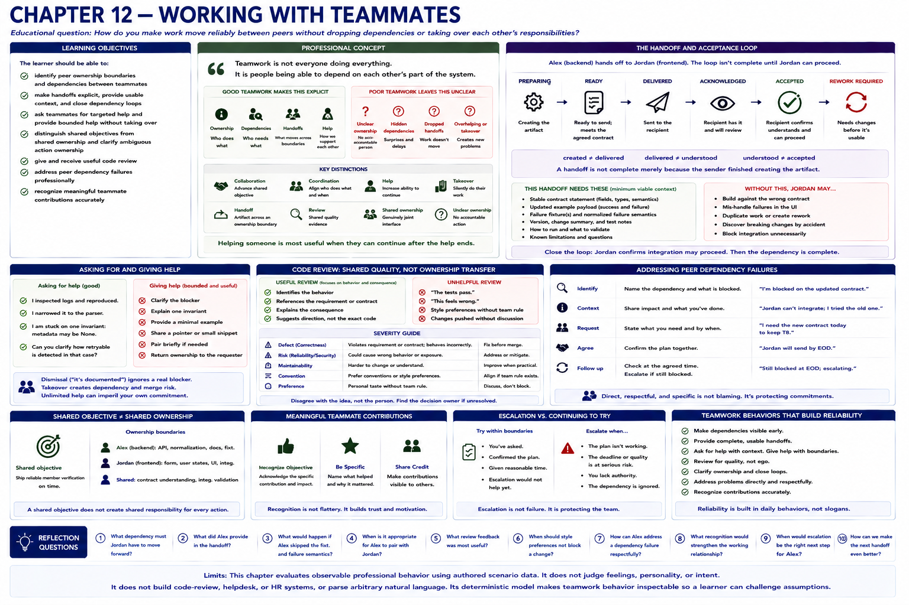

# Chapter 12 — Working With Teammates



## Educational question

> How do you make work move reliably between peers without dropping dependencies or taking over each other's responsibilities?

## Learning objectives

The learner should be able to:

- identify peer ownership boundaries and dependencies between teammates;
- make handoffs explicit, provide usable context, and close dependency loops;
- ask teammates for targeted help and provide bounded help without taking over;
- distinguish shared objectives from shared ownership and clarify ambiguous action ownership;
- give and receive useful code review;
- address peer dependency failures professionally; and
- recognize meaningful teammate contributions accurately.

## Professional concept

> Teamwork is not everyone doing everything. It is people being able to depend on each other's part of the system.

“Be a team player,” “always help,” “never say no,” and “just communicate more” do not say which behavior makes work reliable. Strong teamwork makes ownership, dependencies, handoffs, and help explicit. Shared responsibility does not mean unclear responsibility.

The model keeps important distinctions visible:

- **Collaboration** advances a shared objective; **coordination** aligns who does what and when.
- **Help** increases another person's ability to continue; **takeover** silently transfers their work.
- A **handoff** supplies an artifact across an ownership boundary; a **review** supplies shared quality evidence without transferring implementation ownership.
- **Shared ownership** names a genuinely joint interface; **unclear ownership** leaves an action with no accountable person.
- A **dependency** means one person's progress needs something from another; **blocking** means progress cannot currently continue.

Two people saying “we own this” can still drop the final validation if neither owns that action. Helping someone does not always mean doing their work for them, and constant availability is not collaboration.

## Handoffs and acceptance

Alex owns the verification endpoint, normalization, documentation, and backend handoff. Jordan owns the form, user states, and browser integration. They share contract understanding and integration validation. Jordan should not have to discover contract changes independently, while Alex is not thereby entitled to implement Jordan's frontend.

At T4 Alex's backend is technically complete. The peer dependency is not complete: Jordan still has the old example. The deterministic `Handoff` distinguishes `PREPARING`, `READY`, `DELIVERED`, `ACKNOWLEDGED`, `ACCEPTED`, and `REWORK REQUIRED`:

```text
created != delivered
delivered != understood
understood != accepted
```

> A handoff is not complete merely because the sender finished creating the artifact.

For this consequential integration, Jordan needs the stable contract statement, updated payload, failure fixture, and normalized failure semantics. The loop closes when Jordan can confirm integration may proceed. That is proportional evidence, not a demand for ceremonial acknowledgements on every trivial exchange.

## Helping with boundaries

When Jordan is stuck on the retryable mapping, Alex can clarify the blocker, explain one invariant, provide a minimal example, or pair briefly. Alex should then return frontend ownership. The appropriate boundary depends on request urgency, whether Jordan is blocked, Alex's current commitment risk, alternatives, and expected duration. There is no universal time limit.

> Helping someone is most useful when they can continue after the help ends.

Dismissal with “it's documented” ignores a real blocker. Taking over can duplicate work and create merge risk. Unlimited help can imperil Alex's commitment. Repeated takeover can also teach the system to route every similar problem to Alex. Documenting missing context, improving the interface, pairing once, and returning future ownership prevents help from creating a new dependency.

Asking for context is not incompetence. Alex first inspects logs, reproduces the issue, narrows it to Jordan's parser, and asks about one `metadata=None` invariant. Independent suffering is not a prerequisite for a decision-relevant peer question.

## Review, disagreement, and conflict

Jordan's review identifies that unknown vendor responses become permanent failures despite a retryable requirement. A useful review identifies the behavior, cites the contract, explains the consequence, and suggests direction without dictating implementation. “The tests pass” is not an answer to missing coverage, “this feels wrong” supplies no evidence, and rewriting the branch without discussion transfers ownership unnecessarily.

> Review is shared quality work, not ownership transfer.

Correctness, security, maintainability, convention, and preference are different severities. Chapter 9's preference-versus-defect distinction still applies: preference alone does not block unless a team rule makes it relevant. A peer also has no automatic decision authority. For consequential shared-interface disagreement, identify the decision owner, gather evidence, or run an experiment; consult a manager or architect only when unresolved risk or authority warrants it. Peer disagreement is not automatic upward escalation.

If tension develops, reuse Chapter 10: restore the current issue, ownership, evidence, and decision path rather than inventing a second conflict model.

## Misses, credit, and recovery

When Jordan's T3 schema update is missing, Alex should usually begin with Jordan when safe: state the dependency and ask whether it is still coming or the plan should change. Repeated misses, material release risk, safety, or an unavailable peer can justify later escalation. Silent waiting is not respectful collaboration, and immediate accusation turns coordination into blame.

When shared validation is dropped, recovery identifies the missing owner, assigns the action, completes it, and updates the checklist. Shared interest never created action ownership by itself.

When Alex presents the integration, naming Jordan's meaningful recovery-flow contribution keeps shared work visible. Accurate credit does not diminish Alex's backend contribution, nor does it require exhaustive attribution of every trivial action.

## Engineering concept: explicit interfaces

Two software components collaborate through explicit contracts. If one silently changes its contract, a dependent component can fail. Human collaboration similarly benefits when ownership, interfaces, dependencies, handoffs, and acknowledgements are visible enough for coordination. This is a limited analogy: people are not machines, and judgment, context, opportunity cost, and relationships matter.

## Run the laboratory

```bash
python -m soft_skills_lab scenario verification-integration
python -m soft_skills_lab evaluate verification-integration silent-handoff
python -m soft_skills_lab evaluate verification-integration throw-over-wall
python -m soft_skills_lab evaluate verification-integration over-help
python -m soft_skills_lab evaluate verification-integration wait-for-them-to-ask
python -m soft_skills_lab evaluate verification-integration dependency-blame
python -m soft_skills_lab evaluate verification-integration coordinated-handoff
python -m soft_skills_lab evaluate verification-integration coordinated-help
python -m soft_skills_lab compare verification-integration
python -m soft_skills_lab handoff verification-integration
python -m soft_skills_lab ownership verification-integration
python -m soft_skills_lab evaluate peer-code-review useful-review
python -m soft_skills_lab evaluate teammate-context targeted-context
python -m soft_skills_lab evaluate bounded-peer-help bounded-help
python -m soft_skills_lab evaluate bounded-peer-help takeover
python -m soft_skills_lab evaluate shared-peer-task assign-owner
python -m soft_skills_lab evaluate missed-peer-commitment peer-check
python -m soft_skills_lab evaluate missed-peer-commitment material-escalation
python -m soft_skills_lab evaluate team-contribution accurate-credit
python -m soft_skills_lab evaluate help-dependency restore-ownership
python -m soft_skills_lab collaboration-trust
```

## What to observe

1. Silent completion leaves technically complete work invisible and the loop open.
2. “Backend is done” delivers notice without usable context.
3. Over-help acknowledges the dependency but crosses Jordan's ownership without coordination.
4. Waiting for Jordan to ask ignores Alex's knowledge of the dependency.
5. Dependency blame substitutes local completion for handoff responsibility.
6. Coordinated handoff supplies contract, example, fixture, acknowledgement request, and bounded follow-up.
7. Coordinated and bounded help addresses the blocker while returning ownership.
8. Useful code review distinguishes a correctness defect from preference.
9. A targeted peer-context question follows enough investigation to be answerable.
10. An explicitly assigned action repairs unclear shared ownership.
11. A missed commitment begins with a peer dependency check when appropriate; material repeated risk may escalate later.
12. Contribution visibility accurately describes both people's work.

## Reflection

1. At what point was Alex's backend technically complete?
2. At what point was Alex's responsibility to Jordan complete?
3. What information did Jordan need in the handoff?
4. Why is “backend is done” insufficient?
5. When would modifying Jordan's code directly be appropriate?
6. How can Alex help Jordan without becoming the permanent owner of Jordan's task?
7. When should Alex raise a missed peer dependency with Jordan first?
8. When would manager escalation be appropriate?
9. Why can “shared ownership” become dangerous when no action owner exists?
10. What makes a code review comment useful rather than merely opinionated?
11. How can teammates give each other credit accurately without turning every interaction into formal recognition?

## Limits

All semantics are explicit scenario data; the laboratory does not parse arbitrary conversations, infer personality, score sociability, or define a universal help duration. It does not build a workflow, praise score, or separate teamwork engine. Chapter 13's business-stakeholder behavior remains intentionally deferred.
