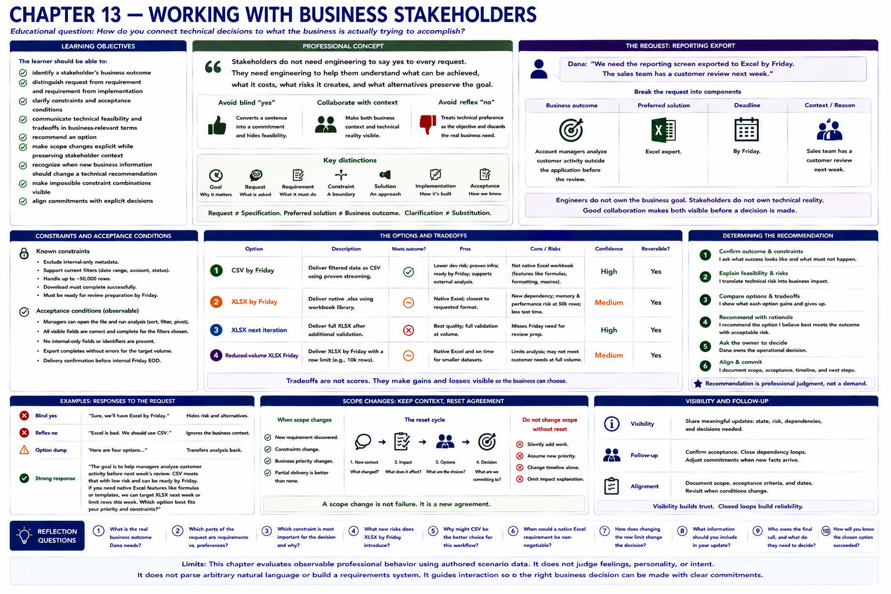

# Chapter 13 — Working With Business Stakeholders



## Educational question

> How do you connect technical decisions to what the business is actually trying to accomplish?

## Learning objectives

The learner should be able to:

- identify a stakeholder's business outcome;
- distinguish request from requirement and requirement from implementation;
- clarify constraints and acceptance conditions;
- communicate technical feasibility and tradeoffs in business-relevant terms;
- recommend an option;
- make scope changes explicit while preserving stakeholder context;
- recognize when new business information should change a technical recommendation;
- make impossible constraint combinations visible; and
- align commitments with explicit decisions.

## Professional concept

> Stakeholders do not need engineering to say yes to every request. They need engineering to help them understand what can be achieved, what it costs, what risks it creates, and what alternatives preserve the goal.

The two tempting extremes both discard context. “Sure, Excel by Friday” converts a sentence directly into a commitment and hides feasibility. “Excel is bad; use CSV” treats technical preference as the objective and discards why Dana asked. Stakeholders usually own important business context. Engineers usually own important technical context. Good collaboration makes both visible before a decision is made.

> Engineers do not own the business goal merely because they understand the implementation.

> Stakeholders do not own technical reality merely because they own the priority.

A business stakeholder is not a nontechnical obstacle. Technical feasibility is not business priority, and urgency cannot manufacture feasibility. Conversely, engineering preferences do not outrank operational needs. Engineering should neither blindly say yes nor reflexively say no.

## Request, outcome, and contract

Dana says, “We need the reporting screen exported to Excel by Friday. The sales team has a customer review next week.” This sentence includes a business outcome, preferred solution, deadline, and contextual reason. Those concepts are related but not interchangeable:

- **Business goal:** account managers analyze customer activity outside the application before the review.
- **Request:** add an Excel export by Friday.
- **Requirement:** a property the accepted outcome must possess, initially a downloadable filtered report.
- **Constraint:** a boundary, such as excluding internal-only metadata.
- **Solution:** CSV, native XLSX, or another way to serve the requirement.
- **Implementation:** the streaming component, workbook library, validation, and resource behavior.
- **Scope:** the fields, filters, volume, format, and delivery increment included.
- **Tradeoff:** what an option gains and gives up.
- **Acceptance condition:** observable evidence that the selected scope works.

Thus `stakeholder request != technical specification`, and a preferred implementation is not automatically the underlying outcome. But this is clarification, not permission for engineering substitution. If an external system accepts only `.xlsx`, macros or template compatibility matter, or a contract specifies a workbook, format is an explicit requirement. CSV is then not equivalent. A technically sensible alternative still requires an explicit expectation change.

## Engineering concept: API contracts

An API client communicates needed behavior through a contract. Internal implementation may change while the contract remains satisfied. In the same limited analogy, a stakeholder may need an outcome without caring about every internal choice. If a property is actually in the contract, however, engineering cannot silently remove it. People are not API clients: goals can be negotiated, evidence can change, and decision ownership must remain explicit. The analogy only makes request, requirement, acceptance, and implementation easier to distinguish.

## The reporting decision

CSV can reuse proven streaming infrastructure and can likely be validated by Friday. Native XLSX introduces a dependency and memory/performance testing, especially for 50,000 rows. Active filters are reusable, and internal-only fields must never be exported.

The laboratory exposes four unscored `TradeoffOption` values:

1. **CSV by Friday:** meets external analysis, timing, filters, and visible-field constraints at lower delivery risk, but lacks native workbook features.
2. **XLSX by Friday:** targets native format and timing, but has lower confidence and unresolved high-volume behavior.
3. **XLSX next iteration:** permits full validation but misses Friday preparation.
4. **Reduced-volume XLSX Friday:** preserves native format and timing only if a narrower row limit is accepted.

Strong behavior confirms the outcome, asks whether workbook-specific behavior matters, explains decision-relevant risk, makes safe scope explicit, and asks the right owner to choose. Stronger behavior also recommends CSV for the immediate workflow when current evidence supports it. Option dumping transfers analysis back to stakeholders; a conditional recommendation contributes professional judgment.

Dana owns operational context and can judge whether CSV serves the immediate workflow. Priya owns this scenario's product scope and release tradeoff. Alex supplies feasibility evidence, owns or recommends technical approach, and names technical risk. Morgan is involved only if delivery or engineering risk crosses agreed thresholds. These boundaries are contextual, not a universal hierarchy.

The tradeoff is unresolved until delivery is explicit. CSV-by-Friday acceptance uses active filters, includes only user-visible fields, opens in common spreadsheet tools, supports an agreed row limit, and passes deterministic validation. A commitment follows that decision; it does not precede it.

## Other stakeholder patterns

### Experienced pain before a metric

“Search is too slow; we need it under one second” begins with observed pain, not necessarily a complete SLO. Median is 700 ms, p95 is 3.8 seconds, and large date ranges are slow. “We already comply,” “we need Redis,” and “one second is unrealistic” each skip a needed question: which workflow and percentile define acceptable experience? Business language often describes pain before a precise acceptance condition.

### Urgent product request

For “bulk customer upload this week or we might lose a deal,” Alex needs deal importance, minimum workflow, volume, validation, and security context. A controlled, reviewed one-time import might preserve the deal while a reusable UI is designed. It is an option, not an automatic preference: operational risk or the actual need may make it inferior.

### Scope change

Scheduled email delivery can be valuable and still be new scope. “Sure” invents a commitment. “That's scope creep” uses scope as a weapon. A professional response acknowledges value, names authorization, scheduling, failure-handling, and operational impact, then offers to keep Friday export and defer scheduling, move the date, or reduce other scope.

> Calling something scope should make tradeoffs visible, not function as a weapon to stop stakeholder ideas.

Scope change is not stakeholder wrongdoing. The `ScopeChange` records original scope, requested addition, delivery impact, available tradeoffs, and eventual decision using the shared decision and commitment architecture.

### Explain a real constraint

“Security won't allow it” invokes mysterious technical authority. The useful explanation says the requested field contains internal risk metadata not authorized for that user role, preserves the account-review goal, and offers an authorized status field when it can serve the decision. Constraints should be explained through decision-relevant consequences.

### Update when the stakeholder is right

When Dana reveals that a downstream system accepts only `.xlsx`, the acceptance contract changes. Alex should withdraw the CSV recommendation and compare reduced-volume XLSX Friday with validated full-volume XLSX later. New business context can legitimately change the technically preferred option. Updating with evidence is strength, as Chapter 9 established.

### Impossible combinations

Full XLSX, 50,000 rows, Friday, no dependency, and no performance risk cannot all hold under the scenario evidence. Professional communication identifies the conflict, refuses to invent certainty, shows which constraint must move, and asks for a priority decision. Business priority is not automatic technical feasibility.

## Trust and observable behavior

Stakeholder trust grows when people learn that engineering will neither blindly say yes nor reflexively say no. Positive evidence includes a clarified goal, visible technical risk, explained tradeoff, recommendation, explicit scope change, aligned commitment, and evidence-based position update. Literalized requests, silent scope changes, hidden constraints, dismissed context, and unsupported commitments are negative evidence. This remains history of behavior, not a personality or stakeholder-satisfaction score.

## Run the laboratory

```bash
python -m soft_skills_lab scenario reporting-export
python -m soft_skills_lab evaluate reporting-export literal-yes
python -m soft_skills_lab evaluate reporting-export technical-no
python -m soft_skills_lab evaluate reporting-export jargon-rejection
python -m soft_skills_lab evaluate reporting-export requirement-interrogation
python -m soft_skills_lab evaluate reporting-export silent-scope-reduction
python -m soft_skills_lab evaluate reporting-export outcome-first-tradeoff
python -m soft_skills_lab evaluate reporting-export recommendation-with-decision
python -m soft_skills_lab compare reporting-export
python -m soft_skills_lab stakeholder-request reporting-export
python -m soft_skills_lab tradeoffs reporting-export
python -m soft_skills_lab evaluate stakeholder-search-performance clarify-experience
python -m soft_skills_lab evaluate urgent-bulk-upload controlled-option
python -m soft_skills_lab scope-change export-scope-change
python -m soft_skills_lab evaluate export-scope-change explicit-options
python -m soft_skills_lab evaluate export-security-constraint safe-alternative
python -m soft_skills_lab evaluate xlsx-required update-recommendation
python -m soft_skills_lab evaluate impossible-export-constraints surface-conflict
python -m soft_skills_lab stakeholder-trust
```

## What to observe

1. Literal acceptance creates an unsupported commitment.
2. Reflexive technical rejection loses the customer-review context.
3. Accurate jargon can still fail Dana's decision level.
4. A question dump creates friction before acknowledging the need.
5. Silent CSV delivery changes expectations even if Excel opens the file.
6. Outcome-first behavior combines clarification, explicit scope, risk, and options.
7. A recommendation adds judgment without taking the product decision.
8. Scope language exposes impact instead of punishing a new idea.
9. Stakeholder-provided downstream evidence changes the valid option set.
10. Impossible constraints produce a priority decision, not a fake promise.

## Reflection

1. What is Dana actually trying to accomplish?
2. Is native Excel definitely required at the start of the scenario?
3. Which technical facts matter to Dana's decision?
4. Why is “CSV is better” an incomplete response?
5. Why is silently shipping CSV a professional problem even if it works?
6. Which option would you recommend and why?
7. What changes if Dana reveals an external system requires `.xlsx`?
8. How should Alex respond when scheduled delivery is added?
9. Which constraints cannot all be satisfied simultaneously?
10. Who owns the business priority?
11. Who owns the technical recommendation?
12. What evidence should cause either side to change position?

## Limits

The model uses authored scenario semantics and does not parse arbitrary conversations, score vocabulary, infer intelligence, create CRM or requirements-management software, or define universal decision hierarchy. `StakeholderRequest`, `TradeoffOption`, and `ScopeChange` extend the shared professional-behavior model rather than creating a stakeholder engine. Chapter 14 remains intentionally unimplemented.
