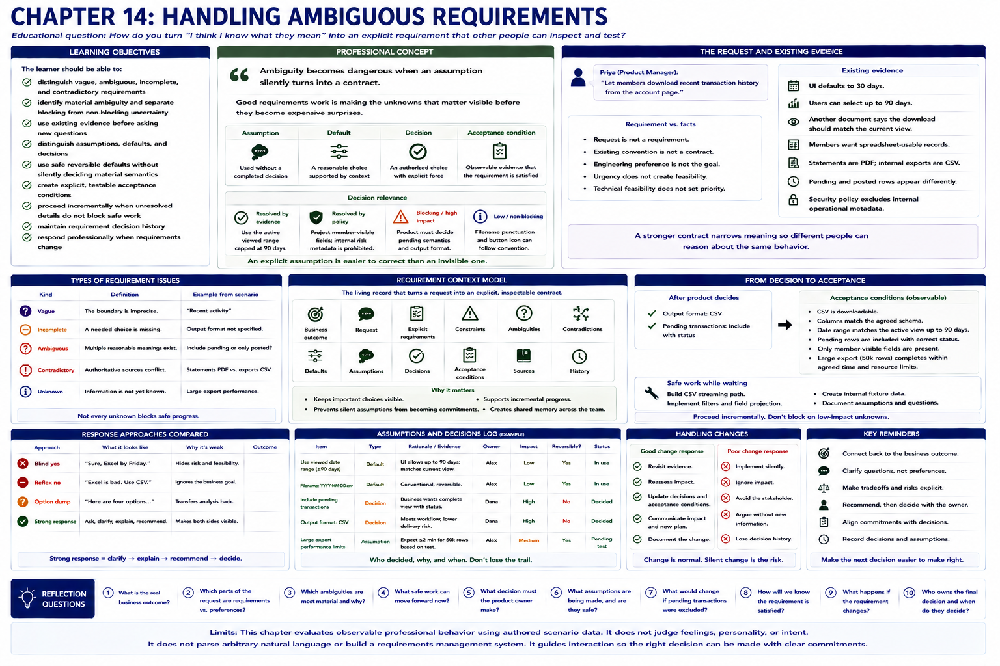

# Chapter 14: Handling Ambiguous Requirements



## Educational question

> How do you turn “I think I know what they mean” into an explicit requirement that other people can inspect and test?

The answer is neither to invent the missing contract nor to wait for a perfect specification. **Ambiguity should be reduced until the next responsible decision can be made.** Not every missing detail is equally important, and a requirement becomes more useful when people can explain how they will know whether it has been satisfied.

## Learning objectives

The learner should be able to:

- distinguish vague, ambiguous, incomplete, and contradictory requirements;
- identify material ambiguity and separate blocking from non-blocking uncertainty;
- use existing evidence before asking new questions and surface contradictory sources;
- distinguish assumptions, defaults, and decisions;
- use safe reversible defaults without silently deciding material product semantics;
- create explicit, testable acceptance conditions;
- proceed incrementally when unresolved details do not block safe work;
- maintain requirement decision history; and
- respond professionally when requirements change.

## Professional concept

> Ambiguity becomes dangerous when an assumption silently turns into a contract.

“Recent activity” is **vague** because its boundary is imprecise. A request is **incomplete** when a needed choice, such as output format, is absent. It is **ambiguous** when “activity” supports multiple meanings, and **contradictory** when authoritative sources prescribe incompatible meanings. An **unknown** describes current knowledge, not necessarily a defect in the request.

An **assumption** is a proposition used without a completed decision. A **default** is a preselected choice supported by context, but it remains subordinate to explicit requirements. A **decision** gives an authorized choice explicit force. An **acceptance condition** states an observable way to determine whether that choice was satisfied.

> Good requirements work is not eliminating every unknown. It is making the unknowns that matter visible before they become expensive surprises.

A reasonable default is stronger when scenario evidence shows that it is conventional, low-risk, reversible, non-security-sensitive, and does not materially change the outcome. It is weaker when it changes customer-visible meaning, authorization, contractual behavior, or irreversible data consequences. These are judgment prompts, not universal rules.

> An explicit assumption is easier to correct than an invisible one.

The laboratory therefore records a filename convention with its reason, owner, impact, reversibility, validation point, and status. It does not silently treat excluding pending transactions as equivalent: that choice changes user-visible semantics and needs product ownership.

## Engineering concept: contracts narrow interpretation

A type or interface is a limited analogy. If an interface permits several incompatible interpretations, independently built callers may make different assumptions. A stronger contract narrows meaning enough for components to interoperate. Similarly, a developer, tester, stakeholder, and dependent teammate need enough explicit semantics to reason about the same behavior.

This analogy has limits. People must still use judgment, evidence, authority, policy, and conversation. The model does not parse prose, infer intent, or become a rigid requirements methodology.

## The transaction-export scenario

Priya is product manager, Dana represents operations, Alex develops the service, and Jordan develops the frontend. The request is:

> Let members download recent transaction history from the account page.

Existing evidence says the UI defaults to 30 days, users can select up to 90 days, another document says the download should match the current view, and members want spreadsheet-usable records. Statements are PDF while internal exports are CSV. Pending and posted rows appear differently. Security policy excludes internal operational metadata.

The smallest useful decomposition is a `RequirementContext`: request, outcome, explicit requirements, constraints, ambiguities, contradictions, defaults, assumptions, decisions, acceptance conditions, sources, safe work, and history. `RequirementAmbiguity` records issue kind, decision impact, evidence, interpretations, deferrability, and any resolution source. These authored values extend the same scenario and response model used by earlier chapters; they are not a separate requirements engine.

### Decision relevance

- **Resolved by evidence:** use the active viewed range, capped at the existing 90-day limit.
- **Resolved by policy:** project member-visible fields; internal risk metadata is prohibited.
- **Blocking/high:** product must decide pending semantics and output format.
- **Low/non-blocking:** filename punctuation and button icon can follow visible reversible conventions.

The 30-day default is evidence of initial UI state, not proof of the export contract. Existing convention also cannot override an explicit requirement.

### From decision to acceptance

After product selects CSV and pending-with-status, the explicit requirement becomes: download the current member view as CSV, including posted and pending rows with explicit status, for ranges up to 90 days.

Acceptance is observable:

1. selecting January 1–31 yields only that range;
2. a pending row has `status=pending`;
3. internal risk metadata is absent;
4. over-90-day requests follow existing report behavior;
5. another member's records never appear; and
6. output satisfies the CSV contract.

These outcomes do not prescribe internal classes, database queries, or libraries. **Acceptance condition does not mean implementation detail.**

### Incremental decision history

The history moves from request receipt, through evidence- and policy-based resolution, to product decisions and finalized acceptance. Requirements often become explicit incrementally. While format and pending semantics remain open, Alex can safely preserve authorization, implement filtered retrieval, and project member-visible fields. Ambiguity does not always prevent all progress.

## Reference paths: what to observe

1. **assume-everything** chooses plausible answers silently. Plausibility does not create an evidence trail or product authority.
2. **literal-minimum** turns a 30-day UI default into a requirement and ignores stronger evidence.
3. **block-on-everything** stops for punctuation, icon, column order, seconds, and quoting. More questions are not better ambiguity management.
4. **contradictory-pick** notices conflict but hides the chosen interpretation.
5. **assumption-as-fact** tells Jordan that CSV and pending inclusion are decided, violating Chapter 6's bounded uncertainty.
6. **resolve-decision-relevant-ambiguity** uses evidence and policy, surfaces material choices, applies a visible reversible default, obtains decisions, and records acceptance.
7. **progressive-clarification** does the same while beginning only the work safe under every remaining interpretation.

## Additional scenarios

### Notification requirement

“Notify users when verification is complete” leaves channel, covered outcomes, timing, delivery failure, and content open. Channel and outcome are product choices; privacy constrains content; timing may be deferred for a bounded first increment. The goal is classification, not indiscriminate questioning.

### Contradictory stakeholders

Dana wants every report field; Priya wants only visible fields; security policy prohibits internal risk metadata. Not every contradiction is resolved by compromise. A higher-order constraint removes the unsafe option, and engineering should say so clearly.

### Retry ambiguity

“Retry failed verification requests” leaves retryable failures, trigger, limit, backoff, and idempotency open. Because blanket retries can duplicate external operations, some apparently technical ambiguity is implementation-critical and blocking.

### Safe reversible UI assumption

Once CSV is explicitly selected, the established `Download CSV` label is low-risk and reversible. Alex can record the convention and validation point rather than block. `missing detail != automatically clarification required`.

### A later change

Priya later excludes pending transactions. The history identifies a change from an earlier accepted condition, assesses code/test/scope/commitment impact, and updates the contract. Normal product learning is not personal failure. Clarification can reveal change rather than an earlier mistake.

## Run the laboratory

```bash
python -m soft_skills_lab scenario transaction-export
python -m soft_skills_lab evaluate transaction-export assume-everything
python -m soft_skills_lab evaluate transaction-export literal-minimum
python -m soft_skills_lab evaluate transaction-export block-on-everything
python -m soft_skills_lab evaluate transaction-export contradictory-pick
python -m soft_skills_lab evaluate transaction-export assumption-as-fact
python -m soft_skills_lab evaluate transaction-export resolve-decision-relevant-ambiguity
python -m soft_skills_lab evaluate transaction-export progressive-clarification
python -m soft_skills_lab compare transaction-export
python -m soft_skills_lab ambiguities transaction-export
python -m soft_skills_lab contradictions transaction-export
python -m soft_skills_lab acceptance transaction-export
python -m soft_skills_lab requirement-history transaction-export
python -m soft_skills_lab scenario verification-notification
python -m soft_skills_lab ambiguities verification-notification
python -m soft_skills_lab scenario contradictory-export-stakeholders
python -m soft_skills_lab scenario verification-retry
python -m soft_skills_lab scenario download-button-default
python -m soft_skills_lab scenario pending-requirement-change
```

The evaluator uses authored semantic fields, so differently worded but behaviorally equivalent responses can produce the same results. It never scores personality, extracts arbitrary requirements from prose, or reduces the dimensions to one number.

## Reflection

1. Which parts of “recent transaction history” are ambiguous?
2. Which questions are already answered by existing product behavior?
3. Why doesn't the 30-day default automatically become the requirement?
4. Which ambiguity would be dangerous to decide silently?
5. Which missing details can safely follow established convention?
6. What makes an assumption reversible?
7. How should contradictory stakeholder statements be handled?
8. When can engineering continue before every decision is final?
9. What makes an acceptance condition testable?
10. How should a later change to pending-transaction behavior be represented?
11. Which constraints cannot be overridden by stakeholder preference?
12. When does clarification become decision-making rather than information gathering?

The working rule is simple but not rigid: **reduce ambiguity until the next responsible decision can be made, make material unknowns visible, and turn resolved meaning into observable acceptance.**
