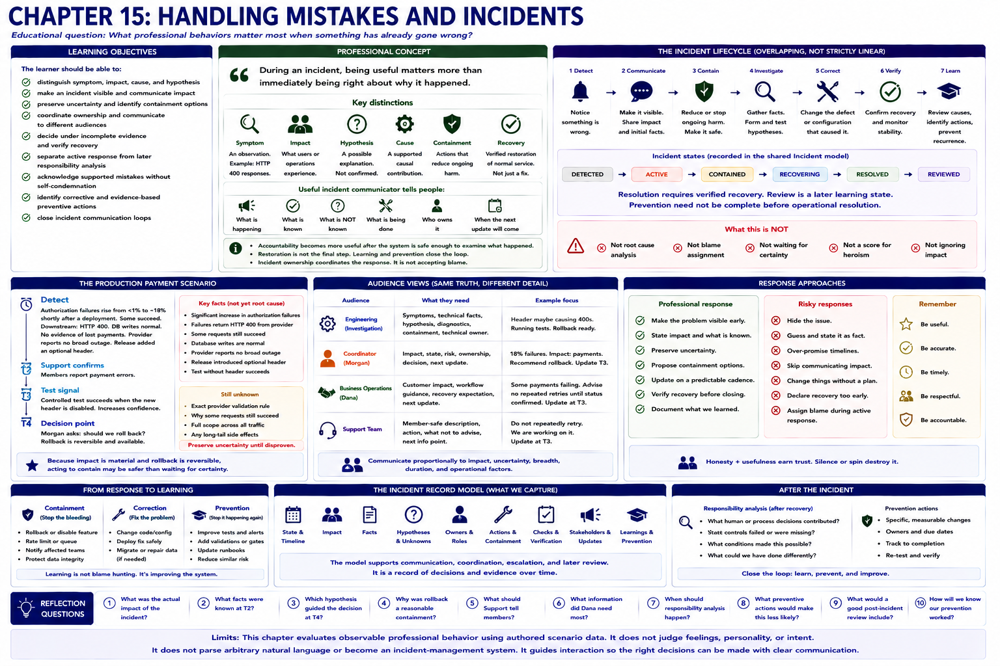

# Chapter 15: Handling Mistakes and Incidents



## Educational question

> What professional behaviors matter most when something has already gone wrong?

During an incident, the first responsibilities are to make the problem visible, reduce harm, preserve uncertainty, establish ownership, and coordinate the next action. Root cause and responsibility matter, but they need not be settled before containment. Fast communication is useful only while it remains accurate.

## Learning objectives

The learner should be able to:

- distinguish symptom, impact, cause, and hypothesis;
- make an incident visible and communicate customer or operational impact;
- preserve uncertainty and identify containment options;
- coordinate ownership and communicate to different audiences;
- decide under incomplete evidence and verify recovery;
- separate active response from later responsibility analysis;
- acknowledge supported mistakes without self-condemnation;
- identify corrective and evidence-based preventive actions; and
- close incident communication loops.

## Professional concept

> During an incident, being useful matters more than immediately being right about why it happened.

An **incident** is a harmful or risky operational event. A **symptom** is an observation, such as HTTP 400 responses. **Impact** is what users or operations experience. A **hypothesis** is a possible explanation; a **cause** is a supported causal contribution; **root cause** is the fuller explanation of why conditions combined. **Containment** reduces ongoing harm, **correction** changes the defect, and **recovery** is verified restoration. **Responsibility** describes supported human or process contributions; **prevention** changes a control based on what was learned. These terms are not interchangeable.

> A reliable incident communicator tells people what is happening, what is known, what is not known, what is being done, and when more information will arrive.

Useful updates flex around impact, current state, facts, unknowns, containment, owner, and next update. A small event may need less. Communication and coordination should be proportional to explicit customer, security, breadth, duration, and operational factors—not an arbitrary personality or heroism score.

Incident ownership means coordinating the response, not accepting blame. Morgan can coordinate while Alex investigates and Dana coordinates business communication. The Alex → Morgan → Dana → Support handoffs matter: incident response often fails at handoffs, not only diagnosis.

> Accountability becomes more useful after the system is safe enough to examine what happened carefully.

During containment, “Jordan caused this” and “I broke production” are both distractions unless evidence and phase make the attribution useful. After recovery, supported contributions should be named specifically. Restoration is not the final professional step.

## Engineering concept

The compact phases are:

```text
detect -> communicate -> contain -> investigate -> correct -> verify -> learn
```

They overlap and need not proceed perfectly linearly. Detection is not root cause; deployment correlation is not causation. A reversible rollback may be sound judgment before full diagnosis. Containment does not complete root-cause analysis. A deployed fix is not verified recovery.

The shared `Incident` model records state (`DETECTED`, `ACTIVE`, `CONTAINED`, `RECOVERING`, `RESOLVED`, `REVIEWED`), impact, facts, hypotheses, unknowns, owners, actions, checks, stakeholders, and next update. Resolution requires verified recovery; review is a later learning state and prevention need not be complete before operational resolution.

## Production payment scenario

At T1, authorization failures rise from below 1% to about 18% shortly after a deployment. Some requests still succeed, downstream responses contain HTTP 400, database writes are normal, no evidence indicates lost payments, the provider reports no broad outage, and the release added an optional header. At T2 support confirms member errors. At T3 a controlled test succeeds with the header disabled. That result strengthens causal evidence but does not alone establish the full root cause. A rollback or targeted correction is available at T4.

Morgan asks whether to roll back. Because impact is material and rollback is reversible, waiting for certainty can be riskier than coordinated containment. Investigation continues afterward.

### Audience views

- **Engineering:** symptoms, technical facts, hypothesis, diagnostics, containment, and technical owner.
- **Coordinator:** impact, state, risk, ownership, decision, and next update.
- **Business operations:** customer impact, workflow guidance, known recovery expectation, and next update.
- **Support:** member-safe description and action, what not to advise, and next information point.

All views preserve the same truth. A useful support update is: “Some payment attempts are currently failing. Members who receive an error should not repeatedly retry until we confirm processing status. Engineering is working on the issue, and we'll provide another update at T3.” Naming an unconfirmed header cause is premature; “payments are broken” is too broad.

### Reference paths: what to observe

1. **hide-and-fix** leaves impact invisible and makes response depend on private success.
2. **blame-first** asserts unsupported vendor fault.
3. **self-blame-first** converts correlation into identity judgment.
4. **investigation-dump** supplies logs but omits impact, state, containment, and action.
5. **premature-root-cause** mistakes a strong controlled-test lead for a complete explanation.
6. **silent-rollback** may work technically but bypasses an available coordination agreement. Authorized immediate action under severe harm can be appropriate; silence is the modeled defect.
7. **coordinated-incident-response** exposes impact and facts, labels the hypothesis, recommends containment, names owners, and promises T3 state.
8. **containment-then-learning** verifies workflows, reconciles uncertainty, updates stakeholders, records supported responsibility, and creates evidence-linked prevention.

## Other incident conditions

A live export endpoint with one fixture exposing internal risk metadata is critical even before production exposure is confirmed. Disable or restrict it, notify security and the manager owner, and preserve evidence. Higher risk justifies faster containment and escalation.

A duplicate metrics exporter can announce an incident when customer requests are normal. Investigate, correct the announcement, and close the loop: declaration is not proof of impact and a false alarm is not a reason to leave an incident open.

If Jordan made a configuration change, defer unsupported individual attribution during containment. If evidence later confirms Alex added the incompatible header and skipped a required compatibility test, Alex should acknowledge that specific contribution, correct it, and add a provider-compatibility gate without self-condemnation.

If Priya says, “Engineering keeps breaking payment flows,” avoid counterattack, refocus on current containment, and preserve any broader pattern question for review. This reuses conflict de-escalation rather than turning an incident into a blame forum.

## Recovery and learning

Recovery evidence can include a normal failure rate, successful controlled transaction, confirmed customer workflow, no unresolved uncertain transactions, and a stable support volume. Closure requires stopped impact, completed containment/correction, verified recovery, stakeholder update, and tracked follow-up. `RESOLVED` is operational; `REVIEWED` records later learning.

The deterministic review covers timeline, impact, contributing conditions, responsibility, detection, containment, correction, and prevention. Provider-header compatibility testing and a documented reversible rollback follow the evidence. Random process additions do not.

Trust grows when someone becomes a reliable source of state under pressure: early reporting, preserved uncertainty, coordinated containment, affected-party updates, verified recovery, supported responsibility, and completed prevention. Hidden incidents, unsupported blame, minimized impact, false recovery, and uninformed stakeholders are negative evidence.

## Run the laboratory

```bash
python -m soft_skills_lab scenario payment-authorization
python -m soft_skills_lab evaluate payment-authorization hide-and-fix
python -m soft_skills_lab evaluate payment-authorization blame-first
python -m soft_skills_lab evaluate payment-authorization self-blame-first
python -m soft_skills_lab evaluate payment-authorization investigation-dump
python -m soft_skills_lab evaluate payment-authorization premature-root-cause
python -m soft_skills_lab evaluate payment-authorization silent-rollback
python -m soft_skills_lab evaluate payment-authorization coordinated-incident-response
python -m soft_skills_lab evaluate payment-authorization containment-then-learning
python -m soft_skills_lab compare payment-authorization
python -m soft_skills_lab incident payment-authorization
python -m soft_skills_lab recovery payment-authorization
python -m soft_skills_lab incident-audience payment-authorization --audience engineering
python -m soft_skills_lab incident-audience payment-authorization --audience manager
python -m soft_skills_lab incident-audience payment-authorization --audience business
python -m soft_skills_lab incident-audience payment-authorization --audience customer-support
python -m soft_skills_lab incident-review payment-authorization
python -m soft_skills_lab incident data-exposure-risk
python -m soft_skills_lab incident payment-alert-false-alarm
python -m soft_skills_lab incident-trust
```

## Reflection

1. At what point should the payment incident become visible to Morgan?
2. Which facts establish customer impact?
3. What evidence links the deployment to the incident?
4. What evidence is missing before claiming full root cause?
5. Why might rollback be appropriate before root cause is known?
6. Who should know what during the incident?
7. Why is a successful correction insufficient to declare recovery?
8. When should individual responsibility be discussed?
9. What should Alex say after learning the header and skipped test were theirs?
10. Which preventive action follows most directly from the evidence?
11. How should possible customer-data exposure change the response?
12. What makes someone a trustworthy source during an incident?

## Limits

This is a professional-behavior teaching model, not monitoring, an SRE platform, probabilistic root-cause inference, security policy, or legal-liability analysis. It does not score calmness, confidence, heroics, or personality, and it does not implement Chapter 16.
