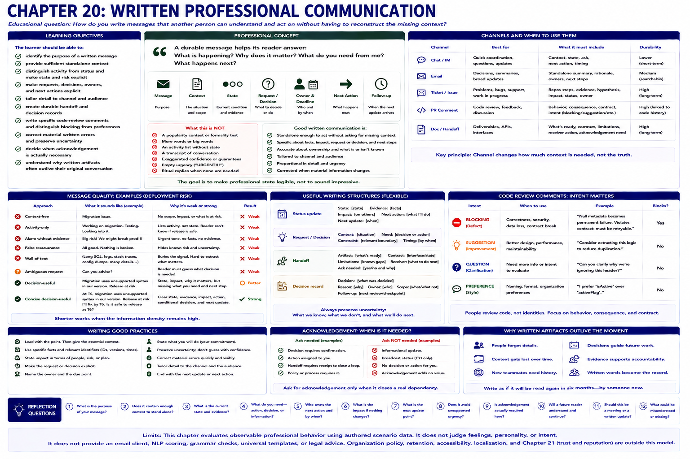

# Chapter 20: Written Professional Communication



## Educational question

> How do you write messages that another person can understand and act on without having to reconstruct the missing context?

## Learning objectives

The learner should be able to:

- identify the purpose of a written message;
- provide sufficient standalone context;
- distinguish activity from status and make state and risk explicit;
- make requests, decisions, owners, and next actions explicit;
- tailor detail to channel and audience;
- create durable handoff and decision records;
- write specific code-review comments and distinguish blocking issues from preferences;
- correct material written errors and preserve uncertainty;
- decide when acknowledgement is actually necessary; and
- understand why written artifacts often outlive their original conversation.

## Professional concept

Writing is where hidden assumptions become especially expensive because the reader may not be able to ask what you meant at the moment they need the information. The goal is not to *sound* professional. The goal is to make professional state legible. A durable message helps its reader answer: **What is happening? Why does it matter? What do you need from me? What happens next?**

Message, context, state, request, decision, action, owner, deadline, evidence, tone, clarity, completeness, and verbosity are distinct. “Can you take a look?” is a request, but it does not say what to inspect, why it matters, how urgent it is, or which decision is needed. Shorter is not automatically clearer. Longer is not automatically more complete. Judge writing by what the reader can reliably understand and act on—not vocabulary, formality, or length.

The laboratory reuses `ProfessionalResponse`. Its `WrittenMessage` adds an authored purpose, audience, channel, context, professional state, facts, uncertainty, impact, request or decision, ownership, next action, and follow-up. It does not parse arbitrary prose. The same truth can have an engineering view with request IDs and test evidence and an operations view with workflow impact and customer guidance.

Channel changes how much context the artifact must carry, not whether its truth changes. Chat often benefits from quick context, state, and a clear ask. Email may need a standalone durable summary. A ticket preserves reproduction, evidence, hypothesis, and continuation state. A PR comment identifies behavior, consequence, contract, and whether its intent is `BLOCKING`, `SUGGESTION`, `QUESTION`, or `PREFERENCE`. A correctness or security defect may block; a naming preference normally does not masquerade as one.

Flexible structures can help without becoming mandatory templates:

- **Status:** state, evidence, impact, next action, next update.
- **Request:** context, request or decision, relevant constraint, needed timing.
- **Handoff:** artifact, contract or state, limitations, receiver action.
- **Decision record:** decision, reason, owner, scope, follow-up.

Good meeting follow-up preserves state change, not conversation history. Good tickets let another person continue without reconstructing the author's memory. Good handoffs identify what is ready, its contract and limitations, the dependency, and whether acknowledgement closes a real loop. Informational messages need no ritual “Thanks!” when no acknowledgement, decision, or action is required.

Written disagreement remains evidence-based: “-1” supplies no useful reasoning, while an architecture manifesto can bury the decision. A focused reply can acknowledge the shared objective, cite the adapter's demonstrated boundary value, and recommend simplification before removal. Likewise, a review comment points to behavior and consequence, not the author's identity.

The draft someone feels like sending may differ from the artifact they choose to send. That is not a model of hidden emotion or forced suppression: only observable sent behavior is evaluated. “You should have read the update” can become: “I changed the example at T4, but did not make the handoff explicit enough. Public field names did not change; the retryable example did. I will resend the contract and explicitly flag future contract changes.”

Urgency comes from scenario impact, not `URGENT!!!`, repeated pings, or punctuation. A low-impact clarification should not receive artificial escalation; a possible security exposure should not be buried in a weekly note. Useful subjects aid retrieval (“Decision needed: T6 migration risk”), but subject-line aesthetics are not scored. Audience follows decision relevance: a clarification for Jordan can be direct; a scope decision affecting five participants belongs in the shared thread.

Written messages can become durable evidence of decisions and commitments. This is a reason to avoid unsupported certainty, explicitly record changes, and correct material errors—not a reason to fear writing or hide uncertainty. If “blocked” proves wrong, a prompt correction to `AT_RISK` improves the shared record. Correcting written state is not loss of credibility; knowingly leaving the false state is worse.

## Engineering concept

An API contract or event message is a limited analogy. A durable system message carries enough explicit state that a receiver does not require the sender's memory. A professional message similarly should not depend on undocumented mental context. People are not services, however: channel, judgment, relationships, and opportunities for clarification still matter.

## Run the laboratory

```bash
python -m soft_skills_lab scenario deployment-risk
python -m soft_skills_lab evaluate deployment-risk context-free
python -m soft_skills_lab evaluate deployment-risk activity-only
python -m soft_skills_lab evaluate deployment-risk alarm-without-evidence
python -m soft_skills_lab evaluate deployment-risk false-reassurance
python -m soft_skills_lab evaluate deployment-risk wall-of-text
python -m soft_skills_lab evaluate deployment-risk ambiguous-request
python -m soft_skills_lab evaluate deployment-risk decision-useful
python -m soft_skills_lab evaluate deployment-risk concise-decision-useful
python -m soft_skills_lab compare deployment-risk
python -m soft_skills_lab written-message deployment-risk decision-useful
python -m soft_skills_lab written-artifact release-readiness-recap
python -m soft_skills_lab written-artifact verification-pr-review
python -m soft_skills_lab written-artifact verification-ticket
python -m soft_skills_lab written-artifact api-handoff
python -m soft_skills_lab written-artifact adapter-disagreement
python -m soft_skills_lab written-artifact security-escalation
python -m soft_skills_lab written-artifact material-correction
python -m soft_skills_lab written-artifact engineering-incident
python -m soft_skills_lab written-artifact operations-incident
python -m soft_skills_lab written-artifact informational-no-reply
```

## What to observe

The context-free path omits scope and impact. Activity-only lists effort without answering whether T6 is safe. The alarm exceeds evidence; reassurance hides material risk. The wall of SQL and logs contains information while burying state. “Can you advise?” makes Morgan guess the decision. Both decision-useful paths retain risk, evidence, unaffected production, Jordan's dependency, Alex's T5 action, the conditional release decision, and the next update. The shorter succeeds because its information density remains high—not because brevity earns credit.

Inspect the other artifacts for a post-meeting decision rather than transcript, evidence-based blocking review, resumable ticket, acknowledged asynchronous handoff, bounded disagreement, proportional security escalation, and material correction. Compare engineering and operations incident artifacts: their detail differs, while the underlying X17 fact and incident truth remain stable. The informational completion note asks for no empty ritual response.

These observations establish important inequalities: activity list is not status; message sent is not loop closed; review comment is not personal judgment; discussion summary is not a decision record unless the decision is explicit; permanence is not a reason to hide uncertainty; and unsupported urgency is not stronger escalation.

## Reflection

1. What does Morgan need to know from the deployment-risk message?
2. Why is “migration issue” insufficient?
3. What is the difference between activity and state in writing?
4. When should a message contain a specific request?
5. Why can a very long message still be unclear?
6. What should a post-meeting note preserve?
7. What makes a PR comment actionable?
8. Why should a naming preference not automatically block a PR?
9. When should an earlier written statement be corrected?
10. Why might an email need more context than a live conversation?
11. When does a handoff require acknowledgement?
12. When is no reply needed at all?

## Limits

This chapter does not provide an email client, NLP judge, grammar score, universal template, or personality/formality measure. It authors deterministic semantics and illustrative wording. Organizational policy, accessibility, legal retention, localization, and Chapter 21's broader trust and reputation treatment remain outside this model.
