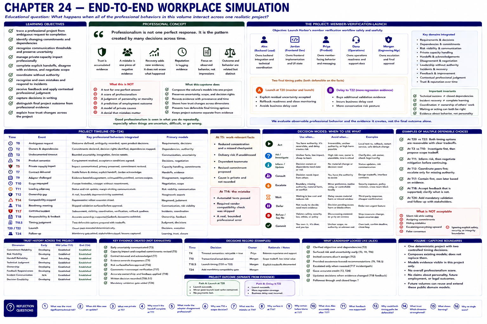

# Chapter 24: End-to-End Workplace Simulation



## Educational question

> What happens when all of the professional behaviors in this volume interact across one realistic project?

## Learning objectives

The learner should be able to:

- trace a professional project from ambiguous request to completion;
- identify changing commitments and dependencies;
- recognize when communication thresholds are crossed and preserve uncertainty;
- manage private capacity impact professionally;
- complete explicit handoffs, disagree with evidence, and negotiate scope;
- coordinate without authority;
- recognize and own mistakes and respond to incidents;
- receive feedback and apply contextual professional judgment;
- capture decisions in writing;
- distinguish final project outcome from professional evidence; and
- explain how trust changes across the project.

## Professional concept

> Professionalism is not one perfect response. It is the pattern created by many decisions across time.

Professional behavior is rarely one isolated conversation. It is a sequence of decisions that creates evidence over time. Alex can communicate a risk well, make a later technical mistake, respond to the incident reliably, and demonstrate learning. Each event remains part of the history.

> A mistake can become one piece of negative evidence without becoming the entire story.

> Recovery does not erase what happened. It adds new evidence about what the person does next.

> Trust becomes more useful when it is traceable to specific behavior rather than vague impressions.

For that reason the laboratory never calculates a capstone professionalism score. A successful launch does not sanitize the skipped validation. A delayed launch does not itself prove failure. Project outcome, professional behavior, and trust evidence are related but distinct.

## Engineering concept: composition without collapse

The earlier chapters created requirements, commitments, evidence, handoffs, incidents, decisions, and trust components. The capstone composes their public models into an ordered project; it does not create parallel evaluators. The orchestrator is intentionally thin: existing chapter scenarios retain the meaning of uncertainty, scope, feedback, incident response, leadership, and judgment, while project events connect them across time.

A system can have correct components and still fail at an integration boundary. Professional integration boundaries appear when one conversation changes another person's plan, a hidden assumption produces an incident, an incomplete handoff blocks a teammate, or a recovery action changes later trust. The history must remain inspectable rather than collapse into one number.

## The project

The deterministic `member-verification-launch` project asks Alex, Jordan, Priya, Morgan, and Dana to launch Harbor's member-verification workflow safely and usefully. The backend normalizes the external vendor into `success`, `retryable-timeout`, and `permanent-failure`; the frontend uses Harbor language; operations supplies support procedures.

### Timeline

| Time | Project event | Integrated behavior |
|---|---|---|
| T0 | Ambiguous request | outcome, evidence, open product decisions |
| T2 | Owners and dependencies named | commitments and decision rights |
| T3 | Undocumented timeout found | bounded uncertainty and investigation |
| T4 | Product semantics decided | requirement resolution and acceptance |
| T5 | Private capacity impact | impact disclosure, privacy, revised commitment |
| T7 | Contract delivered | fixture, stable states, recipient acknowledgement |
| T9 | Adapter challenged | evidence-based disagreement |
| T10 | Email requested | explicit scope tradeoff and deferral |
| T11 | Loading edge case found | decision-useful status and shrinking margin |
| T12 | Ownership gap found | coordination without authority |
| T14 | Compatibility check skipped | a real, bounded professional mistake |
| T16 | Readiness meeting | missing validation surfaced before approval |
| T17 | Controlled incident | visibility, containment, coordination, verification |
| T18 | Responsibility and feedback | supported ownership and future behavior |
| T18.5 | Timing judgment | two defensible paths and a durable record |
| T20/T22 | Launch | selected branch completes deterministically |
| T24 | Follow-up | mandatory validation gate and stakeholder closure |

At T5, the work-relevant facts are reduced concentration, a missed checkpoint, delivery risk, and the dependent teammate. The underlying cause is neither required nor stored in trust history. At T14, passing automated tests does not replace the required vendor compatibility validation. At T17, responders contain before assigning blame; only after evidence confirms the header and skipped check does Alex accurately own that contribution.

## Run the laboratory

Run the reference path and the two bounded judgment branches:

```bash
python -m soft_skills_lab capstone member-verification-launch
python -m soft_skills_lab capstone member-verification-launch --launch-decision monitor-and-launch
python -m soft_skills_lab capstone member-verification-launch --launch-decision delay-for-regression
```

Inspect state and the durable traces:

```bash
python -m soft_skills_lab capstone-step member-verification-launch --at T14
python -m soft_skills_lab capstone-evidence member-verification-launch
python -m soft_skills_lab capstone-trust member-verification-launch
python -m soft_skills_lab capstone-requirements member-verification-launch
python -m soft_skills_lab capstone-decisions member-verification-launch
python -m soft_skills_lab capstone-judgment member-verification-launch
```

The step view includes current state, commitments, cumulative facts and risks, open decisions, and professional evidence created so far. Requirement output follows the ambiguous request through product decisions, acceptance conditions, contract, and launch verification. Decision output includes owner and rationale. Trust output is multidimensional and explicitly has no global score.

## What to observe

Follow requirement ambiguity, decision ownership, dependency creation, early uncertainty, the personal-capacity boundary, explicit handoff, architecture disagreement, scope pressure, status risk, coordination without authority, the validation shortcut, release-readiness disclosure, incident containment, responsibility, conflict de-escalation, feedback, contextual judgment, written decision capture, launch, and trust history.

Notice especially that technical success does not close a dependency: Jordan must acknowledge that the T7 contract and fixture are usable. Incident recovery is not complete learning: the T24 prevention gate and follow-up supply separate evidence. Coordinating the T12 work does not make Alex the owner of every peer's deliverable.

Both timing paths are professionally defensible on the authored facts. T20 accepts explicit residual uncertainty with monitoring and rollback readiness. T22 pays a business delay cost for more regression evidence. Morgan owns the choice. The delayed path is not automatically professional failure, just as a lucky on-time outcome could not legitimize skipped validation.

## Reflection

1. Which project risks were technical and which were coordination risks?
2. At what point did Alex first owe Morgan an update?
3. Which private information was unnecessary at T5?
4. Why was the T7 handoff not complete until Jordan could use it?
5. What made the adapter disagreement professional rather than defensive?
6. Why was the T10 notification request a scope decision rather than “scope creep” as an accusation?
7. What exactly did Alex do wrong at T14?
8. Why should Alex surface the skipped validation at T16 even though no failure has occurred yet?
9. What should happen before assigning individual blame at T17?
10. What part of the incident does Alex accurately own after evidence is complete?
11. Which aspects of Morgan's feedback are supported?
12. Why could both launch-at-T20 and delay-to-T22 be defensible?
13. Which trust dimensions were strengthened?
14. Which trust dimension was weakened by T14?
15. What later evidence demonstrates learning?
16. Why should the capstone avoid producing a single professionalism score?

## Volume I boundary

This capstone is one deterministic project with two controlled launch decisions, not an open-ended organizational simulator. It models evidence visible inside this project; it does not claim to measure a whole person, infer private causes, predict employment outcomes, or resolve legal and organizational policy questions. A future volume can add other project contexts while continuing to compose these public domain models rather than replacing them.
