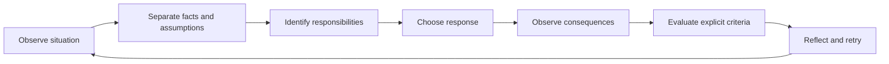

# Laboratory method

```mermaid
flowchart LR
  O[Observe situation] --> F[Separate facts and assumptions]
  F --> R[Identify responsibilities]
  R --> C[Choose response]
  C --> Q[Observe consequences]
  Q --> E[Evaluate explicit criteria]
  E --> T[Reflect and retry]
  T --> O
```
